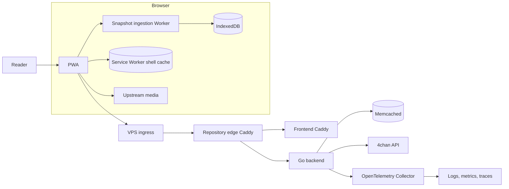
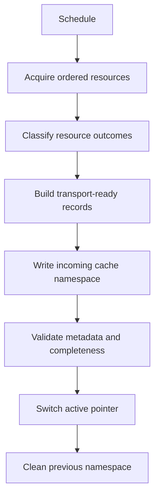
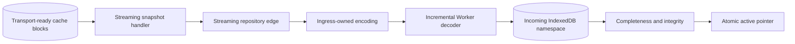
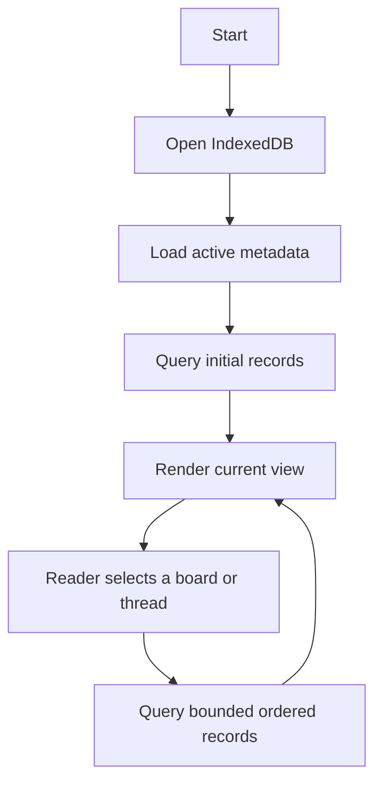

# 4Visor

## Purpose and authority

4Visor is a read-only anonymous Progressive Web App that presents frozen
snapshots of 4chan through a modern, content-focused interface while preserving
the ordering, content, and philosophy of the original platform.

4Visor is a personal-grade project. It favors a small, understandable
deployment over enterprise-grade availability and hardening. This document
defines the intended target architecture; it does not claim that every described
component already exists.

The **Normative requirements** section is the single source of product truth.
Each requirement has a stable identifier. Every other section is explanatory
and refers to those identifiers instead of redefining behavior, values, or
defaults. If explanatory material conflicts with a normative requirement, the
identified requirement wins.

MADRs may decide only matters that a requirement deliberately leaves open.
Generated stories and validation plans implement and prove requirements; they
do not create or override product truth.

## Personas

### Reader

Browses cached snapshots anonymously.

### Operator

Deploys, monitors, and upgrades 4Visor.

## Normative requirements

### Product axioms and scope

- **PROD-01 — Product identity.** 4Visor is a read-only anonymous Progressive
  Web App for browsing 4chan. It has no accounts or identity model and supports
  no posting, replying, deletion, reporting, moderation, or server-side session
  state.
- **PROD-02 — No personalization.** 4Visor provides no preferences,
  personalization, ranking, filtering, recommendations, search, bookmarks,
  saved threads, read state, notifications, analytics, or user tracking.
- **PROD-03 — Upstream fidelity.** The system preserves boards, catalogs,
  threads, posts, page boundaries, and ordering exactly as observed. It does
  not repair, infer, rank, filter, or reorder upstream content. Canonical thread
  and post URLs remain the original 4chan URLs.
- **PROD-04 — Snapshot presentation.** The application presents one frozen
  lineage at a time. Failed, absent, and oversize resources remain honest and
  visible rather than being silently hidden or repaired.
- **PROD-05 — Operational state only.** 4Visor stores only state needed for
  synchronization, serving, and offline operation.

### Snapshot model and content

- **SNAP-01 — Immutable lineages.** Every backend synchronization constructs a
  new immutable lineage independently from scratch. Previous cacheability never
  affects the new lineage.
- **SNAP-02 — Atomic authority.** The backend instance required by DEP-01 is
  authoritative for the active lineage. Clients accept the lineage it serves,
  never merge lineages, and never observe a partially constructed or imported
  lineage.
- **SNAP-03 — Lineage content.** A lineage contains metadata, every observed
  board, each board catalog, eligible threads and posts, explicit known-resource
  failures, oversize markers, original post HTML, and media references.
- **SNAP-04 — Content limits.** Let `C_content = 250`. Catalogs retain the first
  `C_content` threads exactly as returned. Threads retain at most the first
  `C_content` posts; a thread returning more is marked `oversize` and contains
  exactly those first posts.
- **SNAP-05 — Text only.** Backend lineages never contain images, thumbnails,
  video, audio, downloadable files, or other binary media.
- **SNAP-06 — Resource states.** Boards and catalogs are `present` or `failed`.
  Threads are `present`, `failed`, or `oversize`. A known technical acquisition
  failure is explicit; an unexplained missing resource is absent. Failed
  resources contain no payload or failure-detail string.
- **SNAP-07 — Semantic contract.** Lineage metadata includes a valid ULID, the
  UTC RFC 3339 observation time captured when construction starts, a declared
  schema version, ordered resource records, expected record counts, and
  integrity metadata. Contract-owned records reject unknown or missing fields,
  wrong types, invalid state/payload combinations, invalid identifiers,
  non-UTC timestamps, and excess cardinality. Opaque upstream board, page,
  summary, post, and media-reference values preserve unrestricted upstream
  fields and values.
- **SNAP-08 — Version rejection.** A missing, malformed, or unsupported schema
  version rejects the incoming lineage without changing the active lineage.
  There is no implicit migration, adapter, or compatibility window.

### Acquisition workload and scheduling

- **ACQ-01 — Global request rate.** Let `I_request = 1 second`. Outbound 4chan
  request starts are globally separated by at least `I_request` across all
  resource classes, initial attempts, and retries.
- **ACQ-02 — Attempts and retries.** Each request attempt has a five-second
  timeout. A resource receives at most two transient retries with one- and
  two-second backoff; a longer valid `Retry-After` takes precedence. Network
  failures, timeouts, and rate limiting are transient; other HTTP failures are
  terminal. Every retry remains subject to ACQ-01 and ACQ-04.
- **ACQ-03 — Concurrency and identity.** Maximum outbound concurrency defaults
  to 10. Upstream requests use HTTPS. The outbound User-Agent is
  `4Visor/<commit-hash-of-deployed-version>`.
- **ACQ-04 — Acquisition deadline.** A lineage acquisition has a configurable
  maximum duration that defaults to four hours. Work unfinished when it expires
  becomes aggregate deadline failure state as specified by OBS-05 and OBS-06.
- **ACQ-05 — Workload formula.** For a representative successful full
  acquisition, let `B` be the observed board count and `T` the selected thread
  count. Required resources are `R = 1 + B + T`; total attempts are
  `A = R + sum(resource retries)`, with the retry bound defined by ACQ-02. The
  request-start floor is `max(A - 1, 0) × I_request`. Feasibility also accounts
  for attempt latency and timeout occupancy under ACQ-03, retry eligibility
  delays, valid `Retry-After` values, construction, validation, and publication.
- **ACQ-06 — Calibration evidence.** Before changing acquisition defaults,
  record at least two consecutive native full acquisitions on the deployment
  architecture named by DEP-04, with elapsed time, serialized bytes, resource
  counts, attempt counts, and bounded controlled-failure classes. An unknown
  that can be measured is not replaced by an invented production constant.
- **ACQ-07 — Supported budget.** The configured workload must complete the
  representative full acquisition before ACQ-04 with explicit measured
  headroom and without lineage-deadline failures.
- **SCHED-01 — Backend cadence.** Backend synchronization is configurable and
  its default interval equals the default ACQ-04 duration. Startup uses one
  stable instance-local jitter between 5 and 60 seconds. Only one
  synchronization runs at a time while the current lineage remains available.
  At process startup, the backend emits one bounded, secret-free record of the
  effective configured policy governed by ACQ-01–ACQ-04 and SCHED-01, subject to
  OBS-03.
- **SCHED-02 — Client cadence.** A browser checks for a replacement lineage
  approximately once per hour using one stable installation-local jitter in
  the same bounded range as SCHED-01. The browser seed is random, stored only in
  IndexedDB, never derived from fingerprinting data, never sent to the backend,
  and removed by local reset.

### Backend cache and publication

- **CACHE-01 — Cache role.** The Memcached instance required by DEP-01 is the
  ephemeral backend serving cache, not a durable database. One active lineage
  and one incoming lineage may coexist; the active pointer selects the visible
  lineage.
- **CACHE-02 — Block contract.** Let `L_block = 512 KiB` and
  `L_item = 1 MiB`. Lineage blocks use `L_block`, remain below `L_item`, and
  number `ceil(S / L_block)` for serialized lineage bytes `S`.
- **CACHE-03 — Capacity formula.** Required cache capacity is
  `active lineage bytes + incoming lineage bytes + metadata + operational
  headroom`. The deployment allocates 2048 MiB and disables evictions so the
  two lineages can coexist during publication.
- **CACHE-04 — Representative snapshot.** The representative production
  snapshot is the larger of the two most recent successful full acquisitions.
  Cache, transfer, storage, and telemetry budgets are evaluated against its
  independently recorded compressed wire bytes, uncompressed transport bytes,
  cache bytes, IndexedDB bytes, and resource counts.
- **CACHE-05 — Atomic publication.** All required blocks and completion metadata
  are written and validated before the active pointer changes. Construction,
  contract-validation, write, publication, or cancellation failure preserves
  the current pointer. Cleanup of the previous namespace occurs only after a
  successful switch.
- **CACHE-06 — Cleanup lifetime.** Every lineage key has a TTL equal to twice
  SCHED-01. TTL is cleanup insurance, not a substitute for CACHE-03 or the
  normal cleanup in CACHE-05.

### Snapshot transport and HTTP boundaries

- **TRN-01 — Measured format decision.** Before backend publication, HTTP
  serving, browser ingestion, or storage consumers commit to an encoding, one
  early MADR and calibration must select the transfer format from measured
  candidates such as Brotli-compressed JSON, a framed textual representation,
  CBOR or MessagePack, and length-delimited Protobuf. The comparison covers
  compressed and uncompressed bytes, backend encoding cost, Worker and window
  peak memory, IndexedDB bytes, incremental validation, selected-record read
  cost, opaque-field fidelity, schema evolution, browser support, and dependency
  complexity. Simplicity or raw-format intuition alone is not evidence.
- **TRN-02 — Streaming outcome.** The selected format is a versioned,
  stream-decodable sequence of independently decodable frames rather than one
  complete document or one complete binary message. Frames align with IndexedDB
  lineage metadata, board, catalog, thread, and post records.
- **TRN-03 — Completeness and integrity.** A header identifies the schema
  version, lineage, expected record counts, and integrity contract. A terminal
  frame permits verification of completeness and the final digest before
  activation. Every frame and the complete lineage are validated against
  SNAP-07 and SNAP-08.
- **TRN-04 — Serving representation.** Backend publication stores or can emit
  transport-ready frames. Snapshot serving streams them in stored order without
  reconstructing a complete serialized snapshot or decoded lineage graph solely
  to serve HTTP.
- **TRN-05 — Compatibility evidence.** Backend and browser share one small
  compatibility fixture set proving representative order and opaque data, plus
  one schema mismatch and one truncated or integrity failure. Exhaustive frame
  permutation suites are not required when they exercise the same boundary.
- **TRN-06 — Whole-message prohibition.** Production lineage paths must not use
  `response.text()`, `response.json()`, or an equivalent decoder that
  materializes the complete serialized or decoded lineage before staging.
- **HTTP-01 — Snapshot route.** Browser `GET /api/snapshot` maps through the
  repository edge, which removes `/api`, to backend `GET /snapshot`. A missing
  active pointer, incomplete metadata, or missing required block returns
  `410 Gone`; no per-resource snapshot endpoint exists.
- **HTTP-02 — Backend response duration.** The backend applies no fixed absolute
  write deadline to a successful snapshot response and propagates request
  cancellation while streaming.
- **HTTP-03 — Proxy response duration.** The repository edge streams snapshot
  responses without buffering the complete body or imposing a shorter response
  timeout than HTTP-02.
- **HTTP-04 — Ingress allowance.** The VPS ingress response allowance exceeds
  `representative preparation time + representative transfer time + explicit
  headroom` measured for CACHE-04.
- **HTTP-05 — Compression ownership.** Snapshot compression is applied exactly
  once as standard Brotli HTTP content encoding by the VPS ingress. The backend
  and repository edge do not compress snapshot responses. Compression is
  measured separately from the uncompressed representation.

### Browser ingestion, storage, and reads

- **INGEST-01 — Worker ownership.** One dedicated Web Worker owns snapshot
  fetching, incremental decoding, contract validation, digest calculation, and
  bounded-batch staging directly into an incoming IndexedDB lineage namespace.
- **INGEST-02 — Window boundary.** Import communication with the window is
  limited to synchronization commands, cancellation, bounded progress,
  controlled failures, and activation metadata. The window never receives a
  complete response body, serialized lineage, or decoded lineage graph. If
  bytes cross the boundary, `ArrayBuffer` ownership is transferred rather than
  cloned.
- **INGEST-03 — Bounded memory.** Download, decode, validation, digest, and
  staging working memory is bounded independently of total lineage size. Before
  accepting the browser target, a CACHE-04 calibration records peak Worker and
  window memory; this is one-off evidence, not a permanent browser smoke or
  end-to-end suite.
- **INGEST-04 — Failure preservation.** Cancellation, network failure, HTTP
  failure, decode failure, schema failure, digest mismatch, transaction failure,
  and quota exhaustion preserve the active lineage and discard the incoming
  namespace.
- **INGEST-05 — Atomic activation.** Only after all expected records and final
  integrity metadata validate does one short IndexedDB transaction switch the
  active-lineage pointer. Cleanup follows activation and cannot expose a partial
  import.
- **READ-01 — Bounded startup.** Startup loads only active-lineage metadata and
  records required for the initial view.
- **READ-02 — Bounded navigation.** Board, catalog, thread, and post records are
  queried on demand from IndexedDB in stored order. No query, component state,
  or Worker message reconstructs the complete active lineage in window memory.
- **STORE-01 — Storage ownership.** IndexedDB is mandatory and exclusively owns
  snapshot data, the active pointer, incoming namespaces, and the installation
  jitter seed. Service Worker Cache Storage owns only the application shell and
  static assets. IndexedDB unavailability or corruption produces a clear
  mandatory-storage error until local reset; there is no in-memory or
  online-only fallback. When no active lineage exists, the application shows an
  empty state while SCHED-02 continues.
- **STORE-02 — Local reset.** A confirmed Reset local data action removes
  IndexedDB application data, Service Worker application caches, incomplete
  imports, and the installation seed, then reloads the application. It performs
  no server-side action.

### Rendering and media

- **UI-01 — Layout.** The interface is responsive and mobile-first. Catalogs use
  compact rows, replies are visually nested, posts are collapsible, and the
  active lineage identifier and age remain visible.
- **UI-02 — Degraded presentation.** Failed, absent, and oversize resources
  remain in their stored position with clear degraded presentation. Selecting
  a missing resource does not trigger a backend fetch and offers the canonical
  upstream URL where applicable.
- **UI-03 — Safe markup.** The backend stores upstream post HTML unchanged. The
  frontend parses it and applies a strict element and attribute allowlist before
  insertion into the main document. Unsupported markup becomes plain text;
  external links remain clickable and quote links use canonical upstream URLs.
- **MEDIA-01 — Direct media.** Media bypasses the backend. Thumbnails load
  automatically while online; full-resolution media loads only after explicit
  user interaction; spoiler media remains hidden until revealed.
- **MEDIA-02 — Media failure.** The application performs no explicit media
  caching, proxying, transformation, transcoding, or automatic retry. Ordinary
  browser HTTP caching is allowed. Unavailable media shows a fixed placeholder
  and retry is user initiated.

### Failure semantics

- **FAIL-01 — Required dependencies.** When a required component is unavailable,
  the dependent operation fails. There is no fallback cache, repair queue,
  replay system, cross-instance coordination, or hidden reconstruction path.
- **FAIL-02 — Degraded acquisition.** Resource acquisition failures become
  SNAP-06 states and do not prevent activation when construction and publication
  succeed. A board-list failure may activate a lineage whose board collection
  is failed.
- **FAIL-03 — Active-lineage preservation.** Construction, validation,
  publication, cache-write, cancellation, client synchronization, and storage
  failures preserve the last complete active lineage whenever one exists.
- **FAIL-04 — Optional telemetry.** Telemetry export failure does not fail
  unrelated acquisition, serving, or browser operations.
- **FAIL-05 — Boundary errors.** Dependency boundaries distinguish invalid data
  from unavailability, propagate cancellation, preserve underlying causes for
  OBS-02 while exposing controlled error types, and keep diagnostics within
  OBS-03.
- **FAIL-06 — Excessive degradation.** A configurable failure tolerance affects
  observability only. Exceeding it does not prevent activation; it marks the
  synchronization root span as an error and emits one structured error record
  with lineage correlation and bounded actual and tolerated counts.

### Operational diagnosis and observability

- **OBS-01 — Trace roots.** Every scheduled synchronization and inbound HTTP
  request creates a root trace. Child spans represent outbound requests,
  Memcached operations, validation, lineage construction, publication,
  activation, cleanup, serialization, and response streaming where applicable.
- **OBS-02 — Diagnostic outcome.** For acquisition, publication, and
  snapshot-serving failures, the Operator can determine the lineage correlation
  identifier; resource class; queue, rate, concurrency, request, body, decode,
  or retry stage; controlled error and cause types; bounded HTTP response status;
  retry attempt and exhaustion; publication stage or snapshot component; and
  resulting operation and HTTP outcome.
- **OBS-03 — Diagnostic safety.** Diagnostics contain no board or thread
  identifiers, raw URLs, response bodies, cache keys or values, credentials,
  client identity, raw dependency error strings, or other unbounded fields.
- **OBS-04 — Attempt warning.** Emit exactly one warning for every attempted
  resource fetch that terminates after its retry policy. Successful attempts do
  not emit routine lifecycle logs.
- **OBS-05 — Aggregate failures.** Emit one aggregate terminal-failure record per
  lineage and bounded failure tuple. Lineage completion records bounded counts
  and outcome without expanding individual undispatched work.
- **OBS-06 — Deadline cardinality.** Work not dispatched before ACQ-04 is
  aggregate-only and is not reported as a fetch attempt.
- **OBS-07 — Oversize severity.** Oversize resources are expected contract states
  and emit debug events rather than warnings or errors.
- **OBS-08 — Log behavior.** Local structured JSON stderr remains unfiltered.
  Exported application logs include only specified lifecycle, warning, and error
  records with allowlisted attributes; source ownership follows OBS-12.
- **OBS-09 — Trace retention.** The retained trace set contains every complete
  synchronization trace, every trace containing an error, and approximately 10%
  of other fully successful traces. Collector sampling ownership follows
  OBS-12.
- **OBS-10 — Sampling duration.** The tail-sampling decision window governed by
  OBS-12 must exceed `ACQ-04 + publication allowance`; it defaults to five hours
  for the default acquisition budget.
- **OBS-11 — Metric catalogue.** Metrics remain low-cardinality and limited to
  inbound and outbound HTTP volume and latency, cache operations and latency,
  cache hits, misses, and errors, lineage duration and outcome, failed-resource
  counts, and active-lineage age. Metric labels exclude lineage identifiers and
  every field forbidden by OBS-03.
- **OBS-12 — Policy ownership.** Application source filtering owns secrets,
  cardinality, normalization, and the event catalogue. The Collector owns OTLP
  reception, routing, batching, exporter authentication, and trace sampling; it
  does not duplicate application field allowlists as a second failsafe.
- **OBS-13 — Telemetry scope.** OBS-12 applies to Go application telemetry.
  Caddy and third-party container stdout logs are outside that contract.

### Process and dependency status

- **PROC-01 — No application status route.** 4Visor exposes no application
  health or readiness endpoint and configures no Compose health check. Upstream
  DNS and Memcached availability are operational state, not process liveness.
  Process state, snapshot response status, logs, metrics, and traces provide
  operational diagnosis.

### Deployment, security, and dependency ownership

- **DEP-01 — Deployment model.** Docker Compose runs one repository edge Caddy,
  one frontend Caddy, one Go backend, one Memcached instance, and one
  OpenTelemetry Collector. Only the repository edge has a host bind, explicitly
  on `127.0.0.1`; other services remain internal.
- **DEP-02 — Routing ownership.** VPS ingress terminates TLS and reaches the
  repository edge over loopback. The edge owns `/api` prefix removal and routes
  non-API requests to the frontend. The frontend Caddy owns built assets; the
  Go backend owns HTTP application behavior.
- **DEP-03 — First-party images.** Images built and maintained by 4Visor are
  distroless, run rootless, and use read-only filesystems. Third-party images
  use their supported runtime model and are not rebuilt solely to impose those
  controls.
- **DEP-04 — Platform targets.** Linux amd64 is the only supported deployment
  architecture. Chrome for Android 150 and newer is the only supported browser
  target.
- **DEP-05 — Configuration ownership.** Go application configuration is supplied
  exclusively through `FOURVISOR_` environment variables. Caddyfiles, Memcached
  arguments, and Collector configuration use their native mechanisms. Production
  limits and timeouts derive from identified requirements or calibration, never
  guessed deployment defaults.
- **DEP-06 — Frontend dependencies.** Preact is the only frontend framework;
  Tailwind CSS is the styling system; TypeScript, Vite, and native ES modules are
  used for implementation and builds; Vitest provides frontend tests. IndexedDB,
  Fetch, Dedicated Worker, Service Worker, Cache Storage, and History APIs own
  persistence, networking, ingestion, offline shell behavior, and browser
  history directly; a Web App Manifest declares installation metadata. There is
  no additional state-management framework or client-side router.
- **DEP-07 — Backend dependencies.** The backend uses Go, standard library
  `net/http`, Memcached, the OpenTelemetry SDK, and an OTLP exporter. It does not
  introduce an application framework for behavior already owned by the standard
  library.
- **SEC-01 — Exposure boundary.** No application dependency is host-exposed
  except DEP-01. Memcached is reachable only by the backend on the internal
  network. TLS, safe markup, secret-free diagnostics, and first-party image
  controls follow DEP-02, UI-03, OBS-03, and DEP-03 respectively.

### Validation and enforcement

- **TEST-01 — Test classes.** Automated tests are limited to unit and
  integration tests. Smoke, end-to-end, browser end-to-end, and deployment tests
  are not provided.
- **TEST-02 — Unit boundary.** Unit tests start no external process.
- **TEST-03 — Integration dependency ownership.** Integration tests may start
  task-owned dependency containers using dependency-native container ports and
  Docker-assigned host ports bound explicitly to the loopback address established
  by DEP-01. They require no prestarted project stack, fixed shared Compose
  project, or fixed shared host port.
- **TEST-04 — Deployment boundary.** Automated tests do not start the complete
  application deployment, exercise a browser end to end, or probe a deployed
  service.
- **TEST-05 — Build validation.** Native configuration rendering, image
  building, and release-archive assembly are build validation rather than smoke
  or deployment tests.
- **TEST-06 — Native validation first.** A bespoke structural validator is added
  only when the native parser, compiler, build, or configuration command cannot
  prove a required invariant.
- **TEST-07 — Proportional proof.** Test each behavior once at the lowest stable
  boundary that proves it. Add cross-boundary integration coverage only for a
  behavior that can still fail there, such as serialization compatibility,
  dependency semantics, or framework wiring. Do not duplicate one assertion
  across unit, integration, image, Compose, script, and documentation checks.
- **TEST-08 — Negative paths.** Negative-path coverage is required for trust
  boundaries, security rules, cancellation and concurrency, atomic replacement,
  data-loss risks, and observed regressions—not for every branch or log call.
- **TEST-09 — Log contracts.** Log prose is not an API. Test exact wording only
  when it is itself a stable filtering or operator contract; otherwise prove
  severity, event identity, required and forbidden fields, and cardinality with
  one representative event per policy class.
- **TEST-10 — Single enforcement owner.** Each filtering, validation, and
  normalization policy has one authoritative enforcement layer. A second layer
  is allowed only for a distinct trust boundary or independently specified
  failure mode. Test volume, branch count, mutation survival, and assertion
  count are not product goals; validation ends when acceptance criteria and
  material regression risks are proved.

### Continuous integration and release

- **REL-01 — Continuous integration.** Every push to `main` runs all documented
  backend and frontend validation tasks from a clean checkout.
- **REL-02 — Release trigger and identity.** Releases are manually dispatched.
  One release builds backend and frontend images for DEP-04 from the same exact
  commit and publishes immutable commit-derived tags.
- **REL-03 — Supply-chain evidence.** Published images include provenance and
  SBOMs and receive registry attestations.
- **REL-04 — Deployable archive.** The release produces an archive tied to the
  same commit and containing production Compose, Caddy and Collector
  configuration, an environment template, and the operator reference required
  by DOC-03.

### Documentation ownership

- **DOC-01 — Self-documenting code.** Production code explains itself through
  precise names, cohesive modules, explicit types, ordinary control flow, and
  small intention-revealing helpers.
- **DOC-02 — Why-only comments.** When a non-obvious invariant or choice cannot
  be expressed clearly in code, a concise inline comment explains the reason at
  the constrained mechanism. File, module, function, and test comments are not
  required merely for coverage.
- **DOC-03 — Operator reference.** README is limited to project purpose,
  expected environment variables and their defaults, purpose, secrecy, and
  restart implications, plus non-obvious operator constraints such as HTTP-04
  and HTTP-05. It does not teach standard Docker, Docker Compose, shell, Git, or
  service-lifecycle commands and does not narrate implementation details.
- **DOC-04 — Artifact authority.** SEED owns product and architecture
  requirements. MADRs explain genuine choices left open here. Generated stories
  own implementation acceptance criteria. SEED, MADRs, stories, TODO, and
  traceability are specification or process artifacts rather than product
  documentation.
- **DOC-05 — No duplicate product manuals.** Do not generate separate Markdown
  feature, developer, implementation, test, or architecture documentation.
  Encode behavior in code and focused tests and use DOC-02 for remaining
  non-obvious reasoning.

### Explicit exclusions

- **SCOPE-01 — Synchronization exclusions.** Incremental or differential
  synchronization, partial activation, client-side lineage merging, historical
  lineage browsing, version reconciliation, client-triggered acquisition,
  on-demand resource fetching, resumable transfer, and background repair are out
  of scope.
- **SCOPE-02 — Backend exclusions.** Multiple backend replicas, shared backend
  state, distributed cache coherence, leader election, workflow engines,
  message queues, GraphQL, relational or document databases, object storage,
  guaranteed completion, and exactly-once processing are out of scope.
- **SCOPE-03 — Media exclusions.** Backend media storage, proxying, thumbnail
  generation, transcoding, optimization, and offline media persistence are out
  of scope.
- **SCOPE-04 — Frontend exclusions.** React, Vue, Angular, Redux-style state
  management, server-side rendering, hydration, multi-page architecture, and
  unsupported browsers are out of scope.
- **SCOPE-05 — Deployment exclusions.** Linux arm64, Kubernetes, service mesh,
  autoscaling, cross-region replication, distributed consensus, stateful
  orchestration, and enterprise-grade availability are out of scope.
- **SCOPE-06 — Observability exclusions.** Verbose request lifecycle logging,
  high-cardinality metrics, audit logging, business analytics, behavior
  tracking, and session replay are out of scope.

## High-level architecture

The following view explains the boundaries established by DEP-01, DEP-02,
SNAP-02, STORE-01, and MEDIA-01.

The browser is the primary serving layer after synchronization. Backend
availability matters when obtaining a replacement lineage, while the last
complete local lineage provides continuity. The backend remains authoritative
for which lineage is transferred; browser and backend never reconcile partial
state (SNAP-01, SNAP-02, FAIL-03).

## Operational model

### Backend synchronization and publication

Acquisition is governed as one quantitative system rather than as unrelated
timeouts and limits: request volume flows through ACQ-01–ACQ-07 into SCHED-01;
serialized volume flows through CACHE-02–CACHE-04 into publication. The current
lineage remains serviceable throughout construction (CACHE-05).

### Snapshot serving and ingestion

TRN-01 makes the concrete encoding a measured decision, while TRN-02–TRN-06
lock the interoperable streaming outcomes. HTTP-02–HTTP-05 ensure that a
representative snapshot can traverse every server boundary without acquiring a
smaller downstream budget or a second compression owner. INGEST-01–INGEST-05
continue the same framed contract into storage without routing the full lineage
through the window.

### Browser startup and navigation

The import path is not considered bounded if startup or navigation later
reconstructs the lineage. READ-01 and READ-02 therefore extend the memory
boundary through ordinary browsing.

### Failure and diagnosis

Resource degradation is valid snapshot content, whereas construction,
publication, import, and activation failures preserve the last complete
lineage. FAIL-01–FAIL-04 define operation outcomes; OBS-02–OBS-12 define how an
Operator distinguishes their causes without secrets or unbounded fields.

Trace retention follows operational questions. Synchronizations remain
inspectable as complete operations, error traces remain available for failure
analysis, and unrelated successful traffic is sampled according to OBS-09.

## Design rationale

### Snapshot-first and client-first

A complete immutable lineage avoids reconciliation races and partially updated
views. Local IndexedDB reads make backend availability irrelevant to ordinary
browsing after synchronization. These benefits depend on SNAP-01, SNAP-02,
INGEST-05, READ-01, and READ-02 being enforced together.

### Memcached as a serving cache

Memcached is disposable serving state rather than history or durable storage.
Atomic namespaces and a pointer provide the needed publication behavior; the
capacity relationship in CACHE-03 is what makes that design feasible while a
replacement is built.

### Stream and storage alignment

Moving whole-document parsing into a Worker would only move the memory spike.
The transport, Worker, and IndexedDB shapes therefore share record boundaries
under TRN-02 and INGEST-01. Format selection remains open only until TRN-01 has
production-size evidence; downstream consumers may not independently choose
incompatible representations.

### Honest degradation

Failures remain visible because hiding or repairing them would change the
observed snapshot. SNAP-06 and FAIL-02 preserve upstream uncertainty without
making degradation a publication failure.

### Browser platform first

The selected browser APIs already own networking, background ingestion,
persistence, offline shell caching, and history. DEP-06 keeps Preact focused on
rendering rather than wrapping those capabilities in speculative abstraction.

### Trace-first operations

Traces connect long-running synchronization work to its dependency operations.
Sparse logs announce bounded meaningful events, and a small metric catalogue
shows trends. OBS-04–OBS-12 keep those signals useful by defining cardinality,
severity, retention, and ownership rather than merely requesting telemetry.

### Deliberate simplicity

The exclusions in SCOPE-01–SCOPE-06 prevent hidden repair, distributed
coordination, and duplicate delivery paths. Simplicity does not relax the trust
boundaries, atomic data replacement, accessibility basics, or bounded-resource
requirements identified above.
