# 4Visor

## Vision

4Visor is a read-only anonymous Progressive Web App that presents 4chan through
a modern, content-focused interface while preserving the ordering, content and
philosophy of the original platform.

4Visor is a personal-grade project. It favors a small, understandable deployment
over enterprise-grade availability and hardening.

This document defines the intended target architecture. It does not assert that
every described component already exists in the repository.

The system is intentionally opinionated:

- Read-only.
- Anonymous.
- No accounts.
- No personalization.
- No moderation.
- No search.
- No bookmarks.
- No recommendations.
- No client-triggered upstream fetching.

The application presents frozen snapshots of 4chan exactly as observed by the
backend.

## Personas

### Reader

Browses cached snapshots anonymously.

### Operator

Deploys, monitors and upgrades 4Visor.

## Axioms

> These axioms define the fundamental nature of 4Visor. They are stronger than
> requirements and should not change without redefining the project itself.

- 4Visor is a **read-only 4chan reader**.
- 4Visor is a **Progressive Web App**.
- 4Visor is **anonymous** and has no concept of user identity.
- 4Visor does not replace, extend or augment 4chan; it presents existing content
  through a different interface.
- Every backend synchronization produces one **immutable lineage**.
- Every lineage is constructed **independently from scratch**.
- Clients always render from **one complete local lineage**.
- Clients never observe a partially synchronized lineage.
- The backend is authoritative for lineage selection.
- The backend never reasons about, ranks, filters or reorders 4chan content.
- Boards, catalogs, threads and posts preserve upstream ordering exactly as
  observed.
- Original post HTML is stored unchanged.
- The backend caches textual resources only.
- Images, videos and other binary media are never cached by the backend.
- Browser media retrieval is independent of textual snapshot synchronization.
- Failed resources remain visible rather than being silently hidden.
- Degraded lineages are valid snapshots.
- One backend instance is authoritative for the active lineage.
- Client-side snapshots provide continuity when server-side services are
  unavailable.
- Memcached is an ephemeral serving cache rather than a durable database.
- The browser is the primary serving layer after synchronization completes.
- Preact is the only frontend framework used by 4Visor. All persistence,
  networking, offline support and application lifecycle rely directly on browser
  APIs.
- Observability is trace-first.
- Simplicity, determinism and transparency take precedence over completeness and
  automation.
- After synchronization, the browser becomes the serving layer for textual
  content.
- 4Visor stores only operational local state required for synchronization and
  offline operation. It stores no user preferences or personalization.

## Full Requirements

> These requirements describe the intended behavior of 4Visor. They
> intentionally favor determinism, simplicity and observability over
> completeness, configurability and feature richness.

### Product

- 4Visor shall be a read-only anonymous Progressive Web App for browsing 4chan.
- The system shall not support posting, replying, deleting or moderating
  content.
- The system shall not require or support user accounts.
- The system shall not personalize, rank, recommend or curate content.
- The system shall not provide search.
- The system shall not provide bookmarks or read state.
- Canonical thread and post URLs remain the original 4chan URLs.
- The application shall preserve upstream ordering exactly as observed.

### Snapshot model

- Every backend synchronization produces a new immutable lineage.
- Every lineage is constructed independently from previous lineages.
- Previous cacheability never influences future cacheability.
- The active lineage remains available until a replacement lineage completes.
- Lineage activation is atomic.
- Clients never observe a partially synchronized lineage.
- The backend is authoritative; the client accepts the active lineage it serves.

### Backend cache

- Cache every board.
- Cache the first 250 catalog threads exactly as returned by 4chan.
- Cache up to the first 250 posts returned for each thread.
- Threads exceeding 250 posts shall be marked `oversize` and truncated.
- Images, videos and binary attachments shall never be cached by the backend.
- Resources are stored exactly as received except for cache metadata.

### Client synchronization

- The PWA synchronizes approximately once per hour.
- Refresh uses a stable installation-local jitter between 5 and 60 seconds.
- A new lineage is downloaded completely before activation.
- Transport may use one payload or multiple fixed batches transparently.
- The previous lineage remains usable during synchronization.
- On successful validation the new lineage atomically replaces the previous one.
- On failure the previous lineage remains active.
- Only one active lineage is retained after synchronization.

### Local storage

- IndexedDB is mandatory.
- Snapshot data is stored exclusively in IndexedDB.
- Service Worker Cache Storage stores only the application shell and static
  assets.
- If IndexedDB is unavailable the application fails with a clear error.
- A manual "Reset local data" action shall clear all locally stored application
  data.
- Storage quota exhaustion prevents synchronization while preserving the current
  lineage.

### Rendering

- Backend stores upstream HTML unchanged.
- Frontend sanitizes all upstream HTML before rendering.
- Unsupported markup is rendered as plain text.
- External hyperlinks remain clickable.
- Quote links navigate to the canonical 4chan URL.
- The frontend never injects unsanitized upstream HTML into the main document.

### Media

- Thumbnails load automatically while online.
- Full-resolution media loads only after explicit user interaction.
- Browser HTTP caching may retain media opportunistically.
- The application performs no explicit media caching.
- Offline or unavailable media displays a fixed placeholder.
- Retry is user initiated only.
- Spoiler media remains hidden until revealed.

### User interface

- Responsive layout with mobile-first design.
- Board catalogs are displayed as compact rows.
- Replies are visually nested.
- Posts are collapsible.
- Snapshot lineage identifier and age are always visible.
- Failed and oversize resources remain visible with degraded presentation.

### Upstream acquisition

- Default synchronization interval is one hour and configurable.
- Backend startup jitter is stable between 5 and 60 seconds.
- Maximum outbound concurrency defaults to 10.
- Outbound requests are globally rate limited.
- Individual requests time out after five seconds.
- Lineage construction has a maximum duration of thirty minutes.
- Selective retries are permitted only for transient failures such as timeouts,
  network failures and rate limiting.
- Outbound User-Agent is `4Visor/<commit-hash-of-deployed-version>`.

### Failure handling

- Resource acquisition failures are represented as failed resources inside the
  lineage.
- Unknown missing resources remain absent.
- Lineages activate regardless of degradation level.
- Construction, validation, publication, cache-write and cancellation failures
  preserve the current active lineage.
- Excessively degraded lineages emit prominent logs and error traces.
- Unfinished resources when the lineage deadline expires are marked failed.

### Deployment

- Docker Compose is the deployment model.
- A dedicated Caddy reverse proxy is the only host-exposed Compose service and
  binds only to `127.0.0.1`.
- The edge Caddy removes `/api` from `/api/*` requests before proxying them to
  the Go backend; all other requests go to the frontend service.
- The frontend and backend are separate internal services.
- The frontend container uses Caddy to serve built assets.
- The backend container exposes the Go HTTP server directly.
- Project-built container images are distroless, run rootless and use read-only
  filesystems.
- Third-party container images are not required to adopt project-owned
  hardening.
- TLS is terminated by the ingress.
- Go application configuration is provided exclusively through environment
  variables prefixed `FOURVISOR_`.
- Health checks verify backend responsiveness, Memcached availability and 4chan
  DNS resolution.

### Platform and testing

- Linux amd64 is the only supported deployment architecture.
- Chrome for Android 150 and newer is the only supported browser target.
- Automated tests are limited to unit and integration tests.
- Smoke, end-to-end and deployment tests are not provided.

### Observability

- OpenTelemetry is the observability system for Go application telemetry.
- Caddy and third-party container stdout logs are outside the OpenTelemetry
  contract.
- Metrics remain intentionally minimal.
- Logs record meaningful state transitions and failures only.
- HTTP requests and scheduled synchronizations produce root traces.
- Child spans represent HTTP, Memcached and internal operations.
- Successful traces are sampled.
- Failed traces are always retained.

## High-Level Architecture

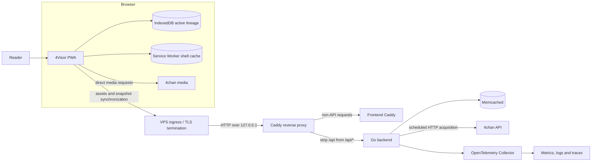
```mermaid
flowchart LR
    User[Reader] --> PWA[4Visor PWA]

    subgraph Client[Browser]
        PWA --> IndexedDB[(IndexedDB active lineage)]
        PWA --> ShellCache[(Service Worker shell cache)]
        PWA -->|direct media requests| Media[4chan media]
    end

    PWA -->|assets and snapshot synchronization| Ingress[VPS ingress / TLS termination]
    Ingress -->|HTTP over 127.0.0.1| Edge[Caddy reverse proxy]
    Edge -->|non-API requests| Frontend[Frontend Caddy]
    Edge -->|strip /api from /api/*| Backend[Go backend]
    Backend --> Memcached[(Memcached)]
    Backend -->|scheduled HTTP acquisition| API[4chan API]
    Backend --> OTel[OpenTelemetry Collector]
    OTel --> Observability[Metrics, logs and traces]
```

4Visor uses a client-first snapshot architecture.

The PWA serves all board and thread content from one complete local lineage
stored in IndexedDB. It contacts the backend only when its refresh interval
expires and a replacement snapshot is due. The client never requests individual
boards, threads or posts from the backend and never calls the 4chan API for
textual content.

The VPS ingress reaches one dedicated Caddy reverse proxy over loopback. Caddy
removes `/api` from `/api/*` requests before proxying them to the internal Go
backend and routes every other request to the internal frontend Caddy. Neither
internal service is exposed on the host.

The single backend acquires 4chan data, constructs a frozen lineage and exposes
the active snapshot from Memcached. Once downloaded, that lineage remains
locally authoritative until the next complete synchronization.

### Client architecture

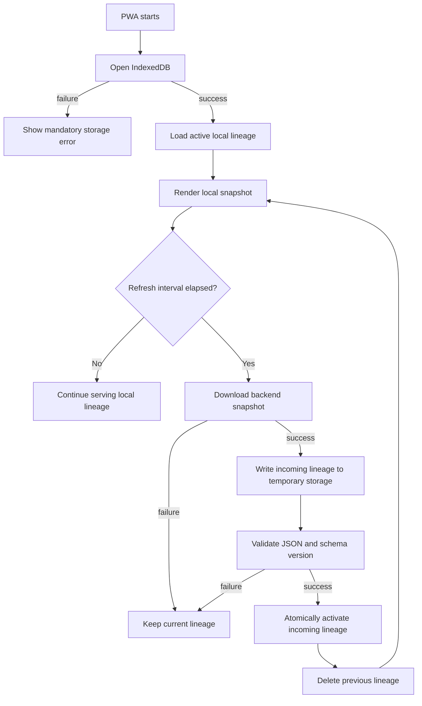
```mermaid
flowchart TD
    Start[PWA starts] --> OpenDB[Open IndexedDB]
    OpenDB -->|failure| StorageError[Show mandatory storage error]
    OpenDB -->|success| LoadActive[Load active local lineage]

    LoadActive --> Render[Render local snapshot]
    Render --> RefreshDue{Refresh interval elapsed?}

    RefreshDue -->|No| Continue[Continue serving local lineage]
    RefreshDue -->|Yes| Fetch[Download backend snapshot]

    Fetch -->|failure| Keep[Keep current lineage]
    Fetch -->|success| Stage[Write incoming lineage to temporary storage]
    Stage --> Validate[Validate JSON and schema version]
    Validate -->|failure| Keep
    Validate -->|success| Swap[Atomically activate incoming lineage]
    Swap --> Cleanup[Delete previous lineage]
    Cleanup --> Render
```

The browser maintains at most:

- one active lineage;
- one temporary incoming lineage during synchronization;
- the application shell and static assets in Service Worker Cache Storage.

The PWA does not progressively merge new data into the visible snapshot. It
continues serving the current lineage until the replacement has been completely
downloaded, parsed, validated and stored.

If synchronization fails, the previous lineage remains available. If storage
quota is insufficient, synchronization stops and the current lineage is
retained.

### Backend

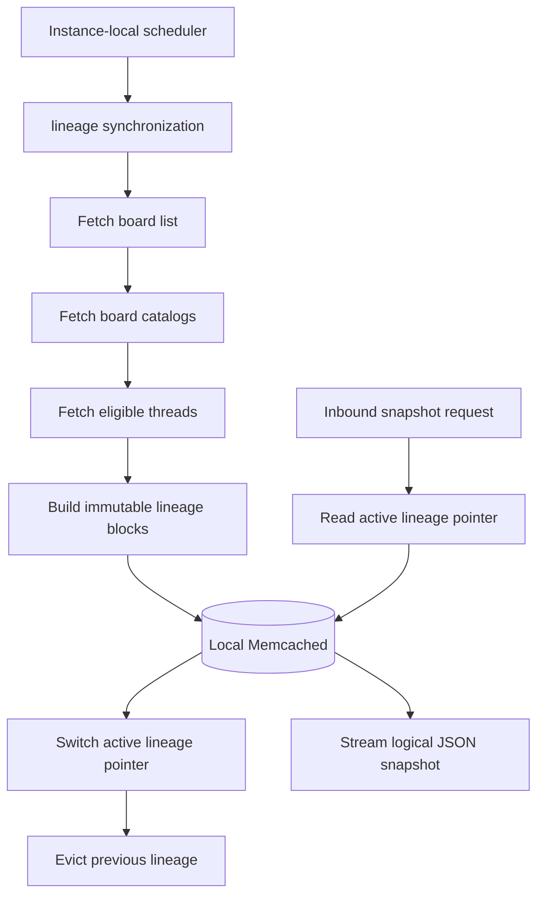
```mermaid
flowchart TD
    Scheduler[Instance-local scheduler] --> Sync[lineage synchronization]
    Sync --> Boards[Fetch board list]
    Boards --> Catalogs[Fetch board catalogs]
    Catalogs --> Threads[Fetch eligible threads]
    Threads --> Build[Build immutable lineage blocks]
    Build --> Memcached[(Local Memcached)]
    Memcached --> Activate[Switch active lineage pointer]
    Activate --> Evict[Evict previous lineage]

    HTTP[Inbound snapshot request] --> Active[Read active lineage pointer]
    Active --> Memcached
    Memcached --> Stream[Stream logical JSON snapshot]
```

The backend owns:

- one Go backend process;
- one Memcached instance;
- one instance-local synchronization schedule;
- one active lineage;
- one lineage under construction when synchronization is running.

A backend synchronization creates a new lineage namespace and writes every
required cache block before activation. The active lineage pointer changes only
after the new lineage is complete from the backend's perspective.

The previous lineage is evicted immediately after activation. Lineage keys also
use a TTL equal to twice the configured synchronization interval as cleanup
insurance.

If the active lineage references a missing Memcached block, the backend returns
HTTP `410 Gone`.

### Single lineage authority

The single backend is authoritative for lineage selection. The client accepts
the completed lineage it serves and does not merge or reconcile lineages.

### Snapshot contents

A lineage contains:

- lineage metadata;
- all boards observed during synchronization;
- the first 250 catalog threads returned for each board;
- up to the first 250 posts returned for each fetched thread;
- explicit failed-resource representations where the resource was known but
  acquisition failed;
- explicit oversize markers where more than 250 posts were returned;
- original post HTML and media references exactly as received.

A lineage does not contain:

- images;
- thumbnails;
- video;
- audio;
- downloadable files;
- user preferences;
- bookmarks;
- read state;
- search indexes;
- recommendations;
- server-side session data.

### HTTP routing

The edge Caddy is the only browser-facing origin. It handles requests in this
order:

1. Requests under `/api/*` have the `/api` prefix removed and are proxied to the
   internal Go HTTP server.
2. Every other request is proxied to the internal frontend Caddy.

The external and internal routes are:

| Browser request      | Go backend request | Behavior |
| -------------------- | ------------------ | -------- |
| `GET /api/snapshot`  | `GET /snapshot`    | Return the active snapshot or `410 Gone` |
| `GET /api/health`    | `GET /health`      | Return `200 OK` when healthy or `503 Service Unavailable` otherwise |

The health response body is non-contractual and must not disclose dependency
details or secrets. No readiness endpoint or additional public backend route is
required.

### Snapshot transfer

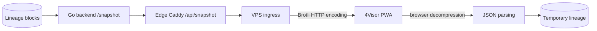
```mermaid
flowchart LR
    Memcached[(Lineage blocks)] --> Backend[Go backend /snapshot]
    Backend --> Edge[Edge Caddy /api/snapshot]
    Edge --> Ingress[VPS ingress]
    Ingress -->|Brotli HTTP encoding| PWA[4Visor PWA]
    PWA -->|browser decompression| Parser[JSON parsing]
    Parser --> IndexedDB[(Temporary lineage)]
```

`GET /api/snapshot` exposes one logical snapshot in one JSON response. The Go
backend receives the request as `GET /snapshot`. Internally, it may store the
lineage as multiple Memcached blocks to remain below per-item limits.

The VPS ingress applies Brotli compression through standard HTTP content
encoding. Both Caddy services forward the response without owning Brotli
compression. The browser performs normal transport decompression before the PWA
parses the JSON.

The architecture does not require:

- range requests;
- resumable downloads;
- per-resource endpoints;
- incremental thread fetching;
- a separate manifest request;
- binary serialization.

If measured snapshot size becomes impractical, the same lineage may later be
exposed as fixed blocks. All blocks would still belong to one atomic client
synchronization and would never be activated partially.

### Snapshot schema version 1

The snapshot is one nested JSON document:

```json
{
  "schemaVersion": 1,
  "lineageId": "01H...",
  "observedAt": "2026-07-26T12:00:00Z",
  "boards": {
    "state": "present",
    "items": [
      {
        "board": {},
        "catalog": {
          "state": "present",
          "pages": [
            {
              "metadata": {},
              "threads": [
                {
                  "summary": {},
                  "thread": { "state": "present", "posts": [] }
                }
              ]
            }
          ]
        }
      }
    ]
  }
}
```

The contract is exact:

- The root requires only integer `schemaVersion`, string `lineageId`, string
  `observedAt` and object `boards`.
- `schemaVersion` is exactly `1`; the route itself is not versioned.
- `lineageId` is a valid ULID. `observedAt` is the UTC RFC 3339 time captured
  when lineage construction starts.
- `boards` is exactly `{ "state": "failed" }` or `{ "state": "present",
  "items": [...] }`.
- A board item requires opaque object `board`; optional `catalog` is absent only
  for an unknown missing catalog.
- A catalog is exactly `{ "state": "failed" }` or `{ "state": "present",
  "pages": [...] }`. The ordered pages contain at most the first 250 thread
  summaries in total.
- A page requires opaque object `metadata` and ordered array `threads`. Page
  order and boundaries are preserved; `metadata` contains every upstream page
  field except `threads`.
- A thread entry requires opaque object `summary`; optional `thread` is absent
  only for an unknown missing thread.
- A thread resource is exactly `{ "state": "failed" }`, or has state `present`
  or `oversize` plus an ordered array of opaque post objects. `present` contains
  zero to 250 posts; `oversize` contains exactly the first 250 returned posts.
- Failed resources contain no payload or failure-detail string. Absent resources
  have no wrapper.
- Contract wrappers reject unknown fields, missing fields, wrong types, invalid
  state/payload combinations, invalid ULIDs, non-UTC timestamps and excess
  cardinality. Board, summary and post objects retain unrestricted upstream
  fields and values.

Clients accept exactly schema version 1. A missing, non-integer or different
version rejects the incoming snapshot while preserving the active local lineage.
Version 1 has no migration, adapter or compatibility window.

### Upstream acquisition

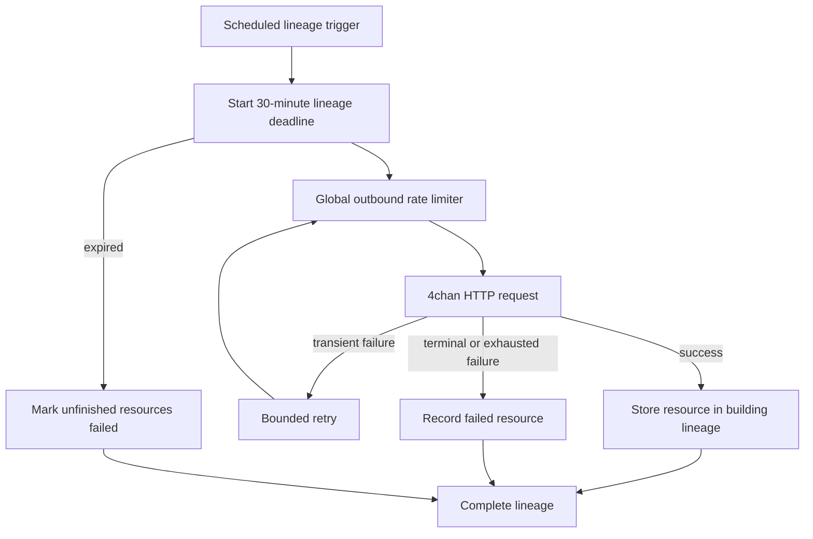
```mermaid
flowchart TD
    Trigger[Scheduled lineage trigger] --> Deadline[Start 30-minute lineage deadline]
    Deadline --> RateLimit[Global outbound rate limiter]
    RateLimit --> Request[4chan HTTP request]
    Request -->|success| Store[Store resource in building lineage]
    Request -->|transient failure| Retry[Bounded retry]
    Retry --> RateLimit
    Request -->|terminal or exhausted failure| Failed[Record failed resource]
    Deadline -->|expired| Unfinished[Mark unfinished resources failed]
    Store --> Complete[Complete lineage]
    Failed --> Complete
    Unfinished --> Complete
```

The backend performs scheduled acquisition on its own schedule.

Default acquisition policy:

- synchronization every hour;
- stable instance-local startup jitter between 5 and 60 seconds;
- maximum outbound concurrency of 10;
- global request rate limiting;
- five-second request timeout;
- thirty-minute maximum lineage duration;
- bounded retries for network failures, timeouts and rate limiting;
- outbound `User-Agent` of `4Visor/<commit-hash-of-deployed-version>`.

The acquisition process stores upstream ordering and values as observed. It does
not rank, reorder, repair or infer missing content.

### Media path

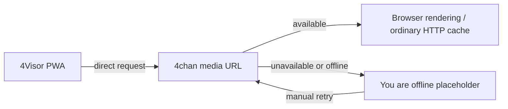
```mermaid
flowchart LR
    PWA[4Visor PWA] -->|direct request| Media[4chan media URL]
    Media -->|available| Browser[Browser rendering / ordinary HTTP cache]
    Media -->|unavailable or offline| Placeholder[You are offline placeholder]
    Placeholder -->|manual retry| Media
```

Media bypasses the backend entirely.

The PWA loads thumbnails automatically while online. Full-size media requires
explicit user interaction. Spoiler media remains hidden until revealed.

The application does not manage a media cache. The browser may retain media
through ordinary HTTP caching, but that behavior is outside the 4Visor data
model.

### Observability path

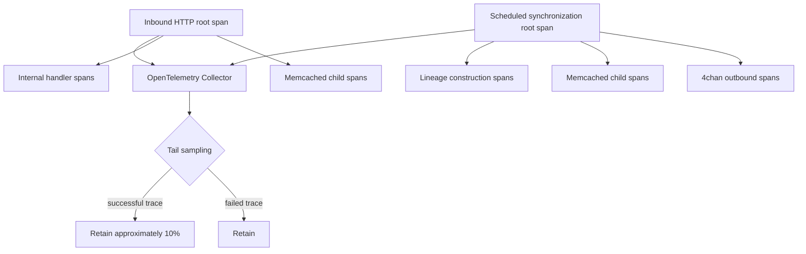
```mermaid
flowchart TD
    Inbound[Inbound HTTP root span] --> Cache[Memcached child spans]
    Inbound --> Handler[Internal handler spans]

    Schedule[Scheduled synchronization root span] --> HTTP[4chan outbound spans]
    Schedule --> Cache2[Memcached child spans]
    Schedule --> Internal[Lineage construction spans]

    Inbound --> Collector[OpenTelemetry Collector]
    Schedule --> Collector
    Collector --> Tail{Tail sampling}
    Tail -->|failed trace| KeepAll[Retain]
    Tail -->|successful trace| Sample[Retain approximately 10%]
```

4Visor is trace-first.

Root spans are created for:

- inbound HTTP requests;
- scheduled lineage synchronizations.

Child spans describe:

- outbound 4chan requests;
- Memcached operations;
- lineage construction;
- lineage activation;
- previous-lineage eviction;
- internal request processing.

Logs record meaningful state transitions and errors rather than routine request
begin/end messages.

Metrics remain limited to high-value signals around:

- inbound HTTP volume and latency;
- outbound HTTP volume and latency;
- Memcached operations, latency, hits, misses and errors;
- lineage duration and outcome;
- failed-resource counts;
- active lineage age.

The OpenTelemetry Collector retains all failed traces and approximately 10
percent of fully successful traces.

## Operational Flows

### Client startup

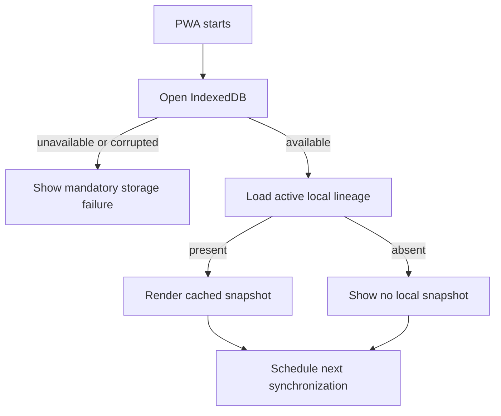
```mermaid
flowchart TD
    Start[PWA starts] --> OpenDB[Open IndexedDB]
    OpenDB -->|unavailable or corrupted| Fail[Show mandatory storage failure]
    OpenDB -->|available| Load[Load active local lineage]
    Load -->|present| Render[Render cached snapshot]
    Load -->|absent| Empty[Show no local snapshot]
    Render --> Schedule[Schedule next synchronization]
    Empty --> Schedule
```

The PWA requires IndexedDB.

If IndexedDB cannot be opened, the application does not fall back to an
in-memory or online-only mode. It shows a clear error explaining that local
browser storage must be available.

If an active lineage exists, it is rendered immediately. The client does not
wait for the backend before becoming usable.

If no lineage exists, the application remains empty until the first complete
synchronization succeeds.

### Client synchronization

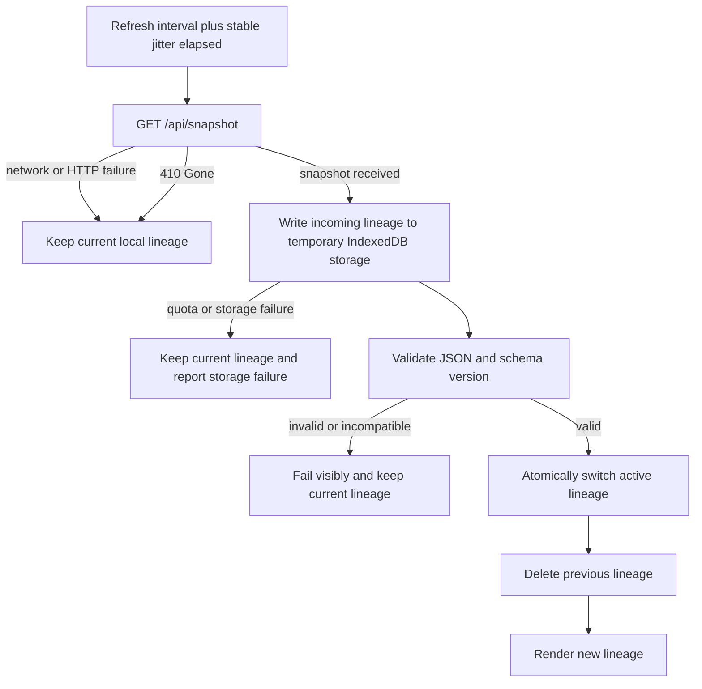
```mermaid
flowchart TD
    Trigger[Refresh interval plus stable jitter elapsed] --> Request[GET /api/snapshot]
    Request -->|network or HTTP failure| Keep[Keep current local lineage]
    Request -->|410 Gone| Keep
    Request -->|snapshot received| Stage[Write incoming lineage to temporary IndexedDB storage]
    Stage -->|quota or storage failure| StorageFail[Keep current lineage and report storage failure]
    Stage --> Validate[Validate JSON and schema version]
    Validate -->|invalid or incompatible| SchemaFail[Fail visibly and keep current lineage]
    Validate -->|valid| Commit[Atomically switch active lineage]
    Commit --> Cleanup[Delete previous lineage]
    Cleanup --> Render[Render new lineage]
```

The client synchronizes one complete lineage at a time.

The transfer may use one response or multiple fixed blocks, but all transferred
data belongs to one lineage and is staged before activation.

The visible snapshot is never progressively mutated. The existing lineage
remains active until the replacement is fully downloaded, parsed, validated and
stored.

The client accepts the lineage served by the backend without comparing its
timestamp or identifier to the local lineage. The backend is authoritative.

If any part of synchronization fails:

- the incoming lineage remains inactive;
- the current lineage remains active;
- the user receives a clear error;
- the client waits until the next scheduled synchronization attempt.

### First installation jitter

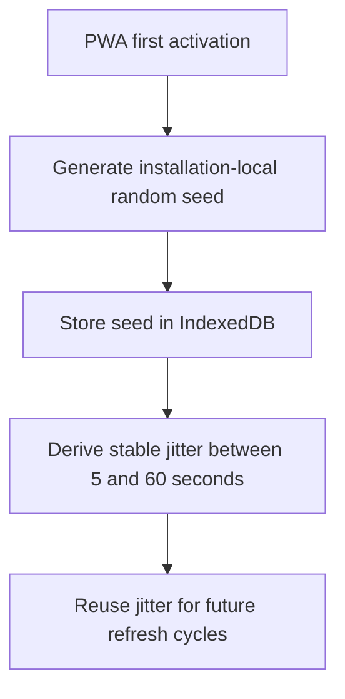
```mermaid
flowchart TD
    Install[PWA first activation] --> Seed[Generate installation-local random seed]
    Seed --> Persist[Store seed in IndexedDB]
    Persist --> Derive[Derive stable jitter between 5 and 60 seconds]
    Derive --> Reuse[Reuse jitter for future refresh cycles]
```

Each browser installation generates a random local seed.

The seed:

- is not derived from device or browser fingerprinting data;
- is never sent to the backend;
- remains stable until local application data is reset;
- determines a stable client synchronization offset.

Resetting local data removes the seed and causes a new offset to be generated.

### Scheduled backend synchronization

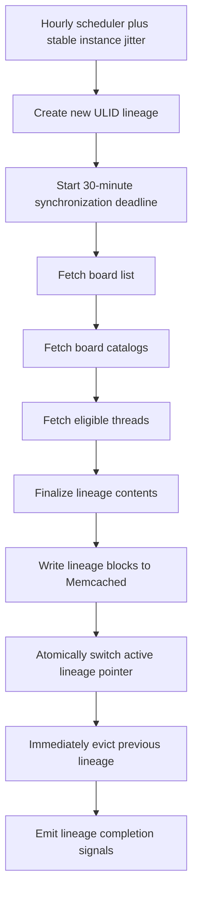
```mermaid
flowchart TD
    Scheduler[Hourly scheduler plus stable instance jitter] --> Begin[Create new ULID lineage]
    Begin --> Deadline[Start 30-minute synchronization deadline]
    Deadline --> Boards[Fetch board list]
    Boards --> Catalogs[Fetch board catalogs]
    Catalogs --> Threads[Fetch eligible threads]
    Threads --> Finalize[Finalize lineage contents]
    Finalize --> Persist[Write lineage blocks to Memcached]
    Persist --> Activate[Atomically switch active lineage pointer]
    Activate --> Evict[Immediately evict previous lineage]
    Evict --> Complete[Emit lineage completion signals]
```

The backend runs its own scheduler and constructs one lineage at a time.

The default synchronization interval is one hour. The backend selects a stable
random startup offset between 5 and 60 seconds.

The synchronization process starts from scratch. No resource is retained merely
because it was cacheable in a previous lineage.

The backend continues serving the current active lineage while the next lineage
is under construction.

### Board acquisition

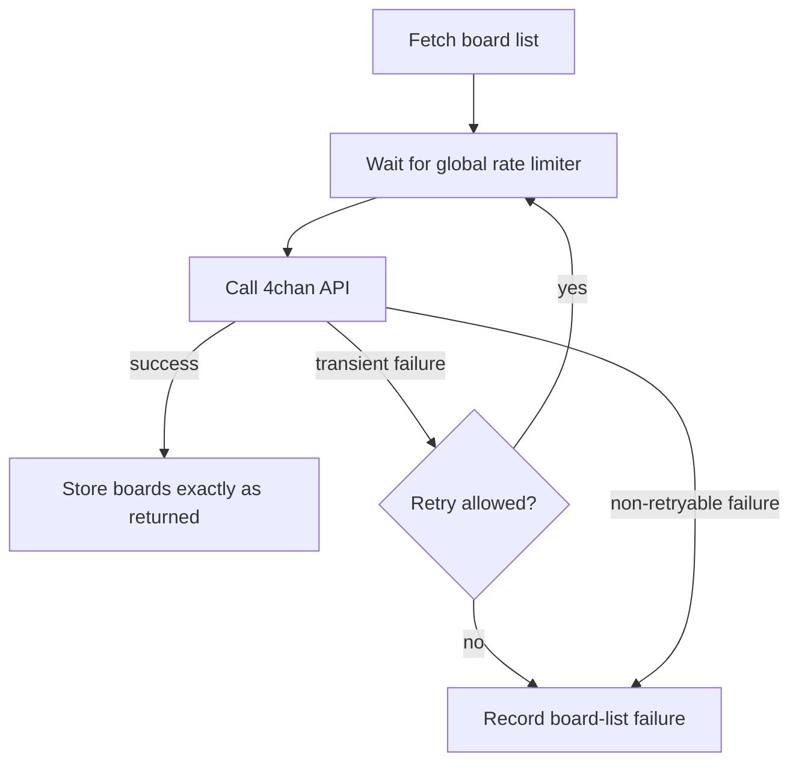
```mermaid
flowchart TD
    Start[Fetch board list] --> Rate[Wait for global rate limiter]
    Rate --> HTTP[Call 4chan API]
    HTTP -->|success| Store[Store boards exactly as returned]
    HTTP -->|transient failure| Retry{Retry allowed?}
    Retry -->|yes| Rate
    Retry -->|no| Failed[Record board-list failure]
    HTTP -->|non-retryable failure| Failed
```

The backend stores board data and ordering exactly as returned by 4chan.

It does not:

- exclude boards;
- reorder boards;
- infer moderation state;
- repair malformed content;
- supplement missing boards from previous lineages.

If the board request fails, the lineage is completed with `boards.state` set to
`failed` and activated when construction and publication succeed.

### Catalog acquisition

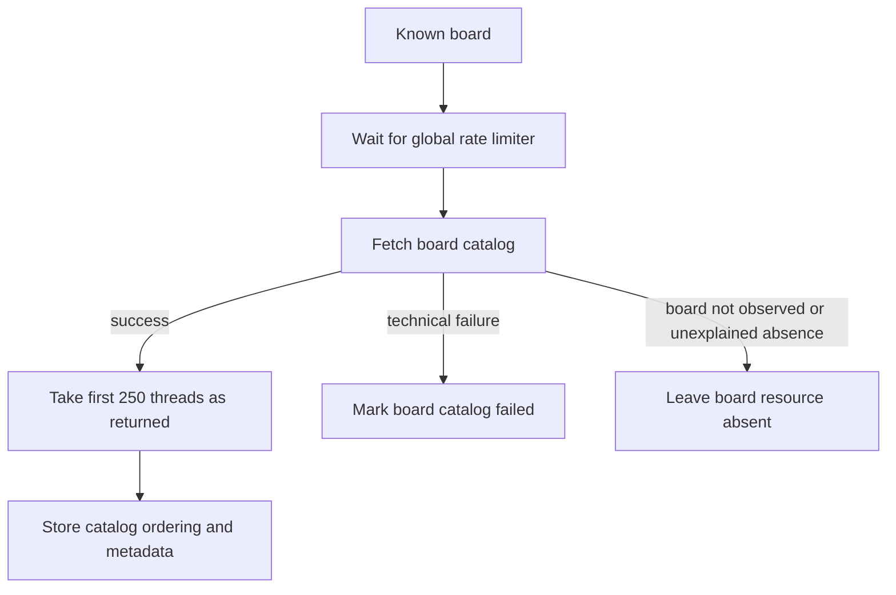
```mermaid
flowchart TD
    Board[Known board] --> Rate[Wait for global rate limiter]
    Rate --> Fetch[Fetch board catalog]
    Fetch -->|success| First[Take first 250 threads as returned]
    First --> Store[Store catalog ordering and metadata]
    Fetch -->|technical failure| Failed[Mark board catalog failed]
    Fetch -->|board not observed or unexplained absence| Absent[Leave board resource absent]
```

For each known board, the backend fetches the catalog and takes the first 250
threads exactly in upstream order.

A technical acquisition failure creates an explicit failed resource.

An unexplained absence remains absent. The backend does not infer that a board
was banned, removed or moderated.

### Thread acquisition

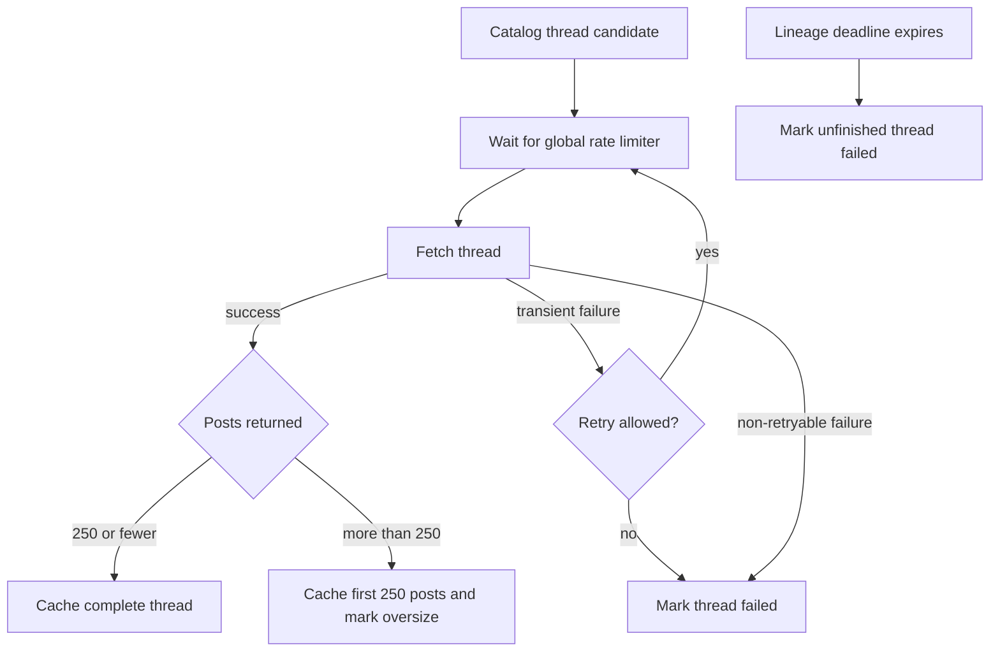
```mermaid
flowchart TD
    Candidate[Catalog thread candidate] --> Rate[Wait for global rate limiter]
    Rate --> Fetch[Fetch thread]
    Fetch -->|success| Count{Posts returned}
    Count -->|250 or fewer| Cache[Cache complete thread]
    Count -->|more than 250| Truncate[Cache first 250 posts and mark oversize]
    Fetch -->|transient failure| Retry{Retry allowed?}
    Retry -->|yes| Rate
    Retry -->|no| Failed[Mark thread failed]
    Fetch -->|non-retryable failure| Failed
    Deadline[Lineage deadline expires] --> Unfinished[Mark unfinished thread failed]
```

The backend caches at most the first 250 posts returned for a thread.

If more than 250 posts are returned:

- the first 250 are cached;
- original ordering is preserved;
- the thread is marked `oversize`;
- the uncached remainder is not retrievable through another endpoint.

There is no client-side or backend escape hatch for fetching the remainder.

### Retry behavior

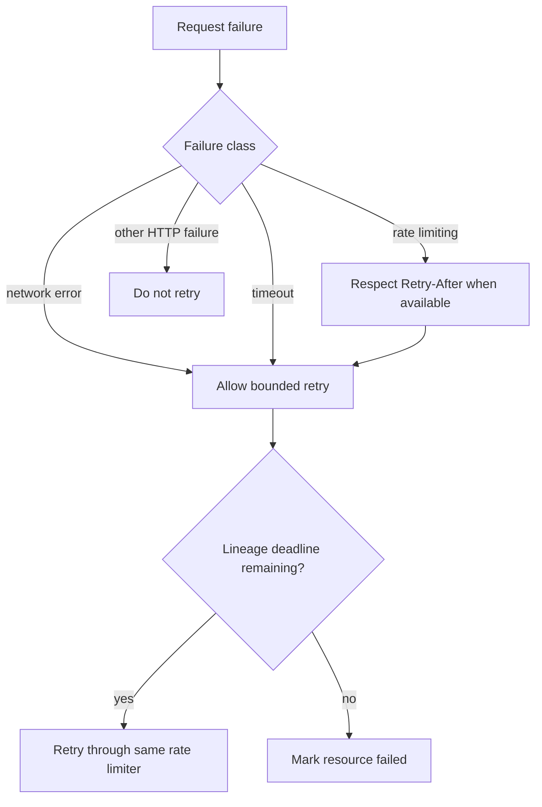
```mermaid
flowchart TD
    Failure[Request failure] --> Classify{Failure class}
    Classify -->|network error| Retry[Allow bounded retry]
    Classify -->|timeout| Retry
    Classify -->|rate limiting| Delay[Respect Retry-After when available]
    Delay --> Retry
    Classify -->|other HTTP failure| Stop[Do not retry]
    Retry --> Deadline{Lineage deadline remaining?}
    Deadline -->|yes| Attempt[Retry through same rate limiter]
    Deadline -->|no| Failed[Mark resource failed]
```

Retries are marginal and selective.

They exist only for transient failures such as:

- network errors;
- request timeouts;
- rate limiting.

Retries remain subject to:

- the global outbound rate limiter;
- the five-second request timeout;
- the thirty-minute lineage deadline.

The system does not provide retry queues, background repair or guaranteed
completion.

### Lineage construction and activation

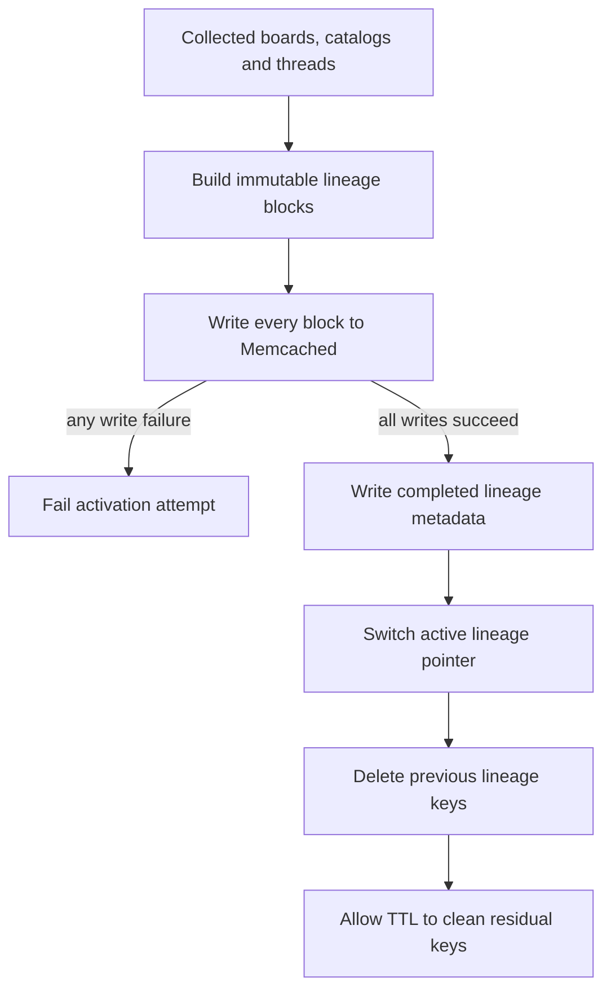
```mermaid
flowchart TD
    Gather[Collected boards, catalogs and threads] --> Build[Build immutable lineage blocks]
    Build --> Write[Write every block to Memcached]
    Write -->|any write failure| Fail[Fail activation attempt]
    Write -->|all writes succeed| Meta[Write completed lineage metadata]
    Meta --> Switch[Switch active lineage pointer]
    Switch --> Evict[Delete previous lineage keys]
    Evict --> TTL[Allow TTL to clean residual keys]
```

Lineage data may be split across multiple Memcached values.

The active pointer is changed only after all required blocks and completion
metadata have been written successfully.

Construction or contract-validation failure, cache-write failure, publication
failure or cancellation prevents the pointer change and preserves the current
active lineage.

The previous lineage is deleted immediately after activation.

All lineage keys also receive a TTL equal to twice the configured
synchronization interval. TTL is a cleanup fallback, not the normal lifecycle
mechanism.

### Serving a snapshot

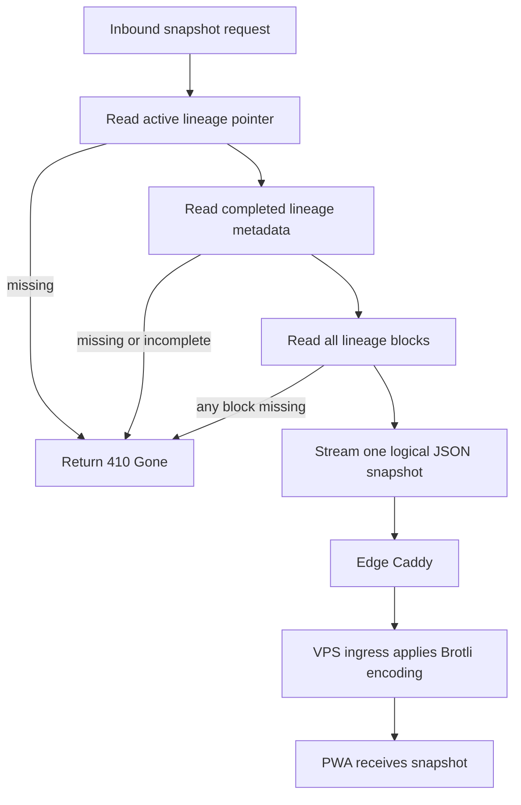
```mermaid
flowchart TD
    Request[Inbound snapshot request] --> Active[Read active lineage pointer]
    Active -->|missing| Gone[Return 410 Gone]
    Active --> Metadata[Read completed lineage metadata]
    Metadata -->|missing or incomplete| Gone
    Metadata --> Blocks[Read all lineage blocks]
    Blocks -->|any block missing| Gone
    Blocks --> Stream[Stream one logical JSON snapshot]
    Stream --> Edge[Edge Caddy]
    Edge --> Ingress[VPS ingress applies Brotli encoding]
    Ingress --> Client[PWA receives snapshot]
```

The backend serves one logical JSON snapshot from `GET /snapshot`. The edge
Caddy exposes it to the browser as `GET /api/snapshot`.

The internal Memcached representation may use multiple blocks, but this does not
require a block-oriented public API.

If the active lineage pointer, completion metadata or any required block is
missing, the backend returns HTTP `410 Gone`.

A missing active resource caused by Memcached eviction is treated as an expired
or unavailable snapshot, not as a normal resource-level `404`.

### Degraded lineage completion

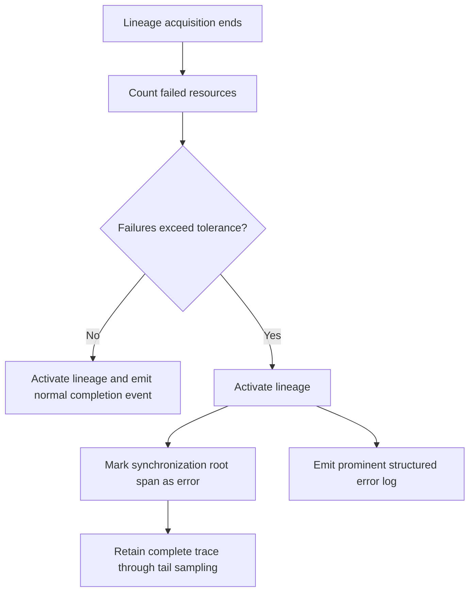
```mermaid
flowchart TD
    Finish[Lineage acquisition ends] --> Count[Count failed resources]
    Count --> Compare{Failures exceed tolerance?}
    Compare -->|No| Normal[Activate lineage and emit normal completion event]
    Compare -->|Yes| Degraded[Activate lineage]
    Degraded --> ErrorSpan[Mark synchronization root span as error]
    Degraded --> AlertLog[Emit prominent structured error log]
    ErrorSpan --> Trace[Retain complete trace through tail sampling]
```

A lineage is always eligible for activation regardless of how incomplete it is.

The failure tolerance exists only for observability.

When failed-resource count exceeds the configured tolerance:

- the lineage still activates;
- the synchronization root span is marked as an error;
- a prominent structured log is emitted;
- the complete trace is retained;
- attributes include the lineage identifier, failed-resource count and tolerated
  count.

This allows the operator to locate the complete trace using the lineage ULID.

### Client rendering

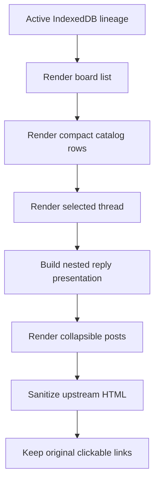
```mermaid
flowchart TD
    Snapshot[Active IndexedDB lineage] --> Boards[Render board list]
    Boards --> Catalog[Render compact catalog rows]
    Catalog --> Thread[Render selected thread]
    Thread --> Nested[Build nested reply presentation]
    Nested --> Posts[Render collapsible posts]
    Posts --> Sanitize[Sanitize upstream HTML]
    Sanitize --> Links[Keep original clickable links]
```

The UI renders only from the active local lineage.

The PWA does not:

- fetch individual missing resources;
- reconcile against a backend after rendering;
- infer deleted or moderated content;
- reorder threads or posts;
- apply personalization or filtering.

Failed and oversize resources remain in their normal position and are displayed
with a clearly degraded appearance.

The active lineage ULID and snapshot age remain visible.

### Missing local resource

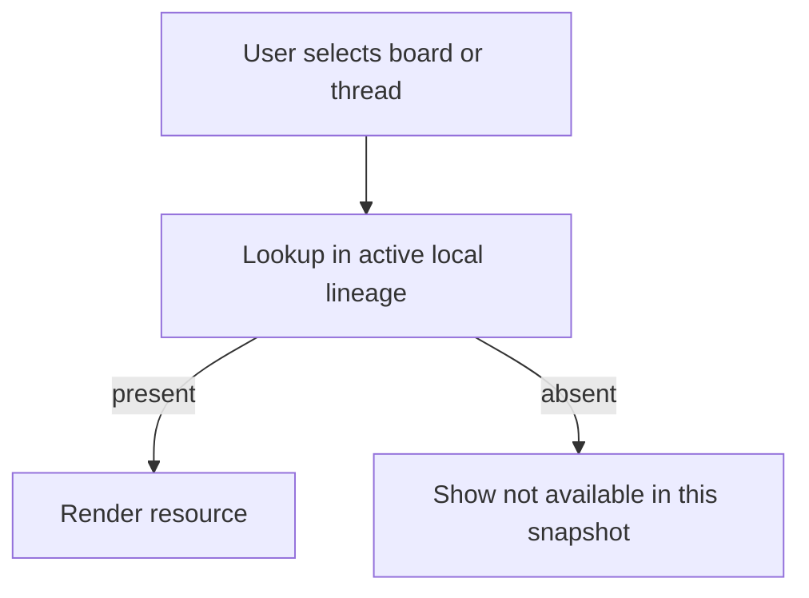
```mermaid
flowchart TD
    Select[User selects board or thread] --> Lookup[Lookup in active local lineage]
    Lookup -->|present| Render[Render resource]
    Lookup -->|absent| Message[Show not available in this snapshot]
```

A missing local resource does not trigger a backend request.

The client does not ask for:

- an individual board;
- an individual catalog;
- an individual thread;
- additional posts;
- an uncached resource.

The user may follow the canonical 4chan URL outside 4Visor.

### Post markup rendering

```mermaid
flowchart TD
    HTML[Upstream post HTML] --> Parse[Parse into DOM]
    Parse --> Allow[Apply strict element and attribute allowlist]
    Allow -->|supported safe markup| Render[Render sanitized markup]
    Allow -->|unsupported markup| Text[Render as plain text]
    Render --> Links[Preserve original link destinations]
```

The backend stores upstream post HTML unchanged.

The PWA sanitizes it before rendering. Unsupported markup is converted to plain
text rather than silently discarded.

All hyperlinks remain clickable and point to their original destinations.

Quote links point directly to the canonical 4chan thread or post URL rather than
navigating inside the PWA.

### Thumbnail loading

```mermaid
flowchart TD
    Post[Post with media metadata] --> Online{Browser online?}
    Online -->|yes| Thumb[Request thumbnail directly from 4chan]
    Online -->|no| Placeholder[Show offline placeholder]
    Thumb -->|success| Display[Display thumbnail]
    Thumb -->|failure| Placeholder
    Placeholder --> Retry[Offer manual retry]
    Retry --> Thumb
```

Thumbnails are requested directly from 4chan while online.

Neither the backend nor the PWA explicitly caches them. The browser may retain
them through ordinary HTTP caching.

Failures remain manually retryable without an application-imposed attempt limit.

### Full media loading

```mermaid
flowchart TD
    Thumbnail[Thumbnail or media reference] --> Action[User explicitly opens media]
    Action --> Request[Request original media URL]
    Request -->|success| Display[Display using native browser behavior]
    Request -->|failure| Placeholder[Show unavailable or offline placeholder]
    Placeholder --> Retry[User retries manually]
    Retry --> Request
```

Full-size media is never loaded automatically.

Images, video, audio and files are handled according to their original
representation. 4Visor does not proxy, transform or persist them.

Spoiler media remains hidden until explicitly revealed.

### Local reset

```mermaid
flowchart TD
    User[User selects Reset local data] --> Confirm[Confirm destructive local action]
    Confirm --> DB[Delete IndexedDB databases]
    DB --> Cache[Delete Service Worker application caches]
    Cache --> Seed[Remove installation jitter seed]
    Seed --> Reload[Reload application]
```

The reset action affects only the current browser installation.

It removes:

- active lineage;
- incomplete incoming lineage;
- installation-local jitter seed;
- application shell caches.

It performs no server-side operation.

### Backend component failure

```mermaid
flowchart TD
    Operation[Backend operation] --> Dependency{Required component available?}
    Dependency -->|yes| Continue[Continue operation]
    Dependency -->|no| Fail[Fail operation]
```

The failure principle is deliberately simple:

> A required component fails, the operation fails.

Examples:

- Memcached unavailable: snapshot reads and lineage writes fail.
- 4chan resolution or acquisition unavailable: affected acquisition work fails.
- Ingress unavailable: client synchronization fails.
- IndexedDB unavailable: the PWA fails.

The system does not contain alternate caches, cross-instance failover
coordination, fallback stores or hidden repair paths.

The PWA's existing local lineage is the only meaningful client-side continuity
mechanism.

### Health check

```mermaid
flowchart TD
    Probe[Health request] --> HTTP[Can backend reply?]
    HTTP -->|no| Unhealthy[Unhealthy]
    HTTP -->|yes| Cache[Can backend reach Memcached?]
    Cache -->|no| Unhealthy
    Cache -->|yes| DNS[Can backend resolve 4chan?]
    DNS -->|no| Unhealthy
    DNS -->|yes| Healthy[Healthy]
```

Health checking remains intentionally shallow.

The health endpoint verifies:

- backend responsiveness;
- Memcached reachability;
- 4chan DNS resolution.

It does not validate:

- lineage completeness;
- current snapshot quality;
- upstream HTTP success;
- synchronization freshness beyond separately exported observability signals.

### Trace flow for inbound requests

```mermaid
flowchart TD
    Request[Inbound HTTP request] --> Root[HTTP server root span]
    Root --> Pointer[Memcached active-pointer span]
    Root --> Metadata[Memcached metadata span]
    Root --> Blocks[Memcached block-read spans]
    Root --> Encode[Snapshot serialization span]
    Root --> Response[HTTP response]
```

Routine request begin/end events are not logged.

Errors:

- are logged;
- mark the relevant span as error;
- propagate meaningful status to the root span when the request fails.

### Trace flow for scheduled synchronization

```mermaid
flowchart TD
    Trigger[Scheduler trigger] --> Root[Lineage synchronization root span]
    Root --> Boards[Board acquisition spans]
    Root --> Catalogs[Catalog acquisition spans]
    Root --> Threads[Thread acquisition spans]
    Root --> Cache[Memcached write spans]
    Root --> Activate[Lineage activation span]
    Root --> Evict[Previous-lineage eviction span]
    Root --> Summary[Completion attributes and event]
```

The lineage ULID is attached to the synchronization trace.

Individual outbound calls and Memcached operations are represented as child
spans. This allows one degraded lineage to be inspected from its root trigger
through every upstream and cache operation.

### Telemetry export

```mermaid
flowchart TD
    App[4Visor backend] --> Collector[OpenTelemetry Collector]
    Collector --> Logs[Filter and export interesting logs]
    Collector --> Metrics[Export minimal metrics]
    Collector --> Tail[Tail-based trace sampling]
    Tail -->|any span failed| All[Retain 100%]
    Tail -->|fully successful| Ten[Retain approximately 10%]
```

Logs are exported for:

- lineage start and completion;
- lineage activation;
- previous-lineage eviction;
- excessive lineage degradation;
- meaningful item counts;
- outbound acquisition summaries;
- errors of any kind.

Routine successful inbound request lifecycle logs are not emitted.

Metrics remain low-cardinality and avoid labels such as:

- lineage ULID;
- thread identifier;
- full URL;
- Memcached key;
- client identity;
- raw error message.

## Deployment View

```mermaid
flowchart TB
Internet-->Ingress[VPS Ingress<br/>TLS termination]
Ingress-->|HTTP over 127.0.0.1|Edge[Caddy reverse proxy]
subgraph DockerCompose
Edge[Caddy reverse proxy]
Frontend[Frontend Caddy]
Backend[Go backend]
Mem[(Memcached)]
OTel[OpenTelemetry Collector]
Edge-->|non-API requests|Frontend
Edge-->|strip /api from /api/*|Backend
Backend-->Mem
Backend-->OTel
end
Backend-->|HTTPS|API[4chan API]
OTel-->Obs[Metrics · Logs · Traces]
```

### Deployment philosophy

4Visor uses a deliberately minimal deployment model.

- VPS ingress terminates TLS.
- A dedicated edge Caddy binds to `127.0.0.1` and is the only host-exposed
  Compose service.
- One internal frontend Caddy serves built assets.
- One internal Go backend serves `GET /snapshot` and `GET /health` directly.
- One Memcached instance and one OpenTelemetry Collector remain internal.

The personal-grade deployment accepts single-service outages. The client's
previously synchronized lineage provides continuity while server-side services
are unavailable.

### Backend

```mermaid
flowchart LR
Scheduler-->Backend[Go backend]
Backend-->Mem[(Local Memcached)]
Backend-->API[4chan API]
Backend-->OTel[OpenTelemetry]
```

The backend owns exactly one Memcached instance.

### Container model

```mermaid
flowchart TB
subgraph DockerCompose
Edge[Caddy reverse proxy]
Frontend[Frontend Caddy]
Backend[Go backend container]
Memcached[Memcached container]
OTel[OpenTelemetry Collector]
Edge-->Frontend
Edge-->Backend
Backend-->Memcached
Backend-->OTel
end
```

The edge Caddy is the only service with a host bind. The frontend, backend,
Memcached and OpenTelemetry Collector are internal Compose services.

Images built and maintained by 4Visor are distroless, run rootless and use a
read-only filesystem. Third-party images are used according to their supported
runtime model and are not rebuilt solely to adopt these controls.

The Go application is configured exclusively through `FOURVISOR_` environment
variables. Caddyfiles, Memcached arguments and OpenTelemetry Collector
configuration use their native mechanisms.

### Health model

```mermaid
flowchart TD
Probe[GET /health]-->HTTP{Backend responds?}
HTTP-->|No|Fail[Unhealthy]
HTTP-->|Yes|Cache{Memcached reachable?}
Cache-->|No|Fail
Cache-->|Yes|DNS{4chan DNS resolves?}
DNS-->|No|Fail
DNS-->|Yes|Healthy[Healthy]
```

Health checks verify only backend responsiveness, Memcached reachability and
4chan DNS resolution.

### Traffic

```mermaid
flowchart LR
PWA-->Ingress[VPS ingress]
Ingress-->|127.0.0.1|Edge[Caddy reverse proxy]
Edge-->|non-API requests|Frontend[Frontend Caddy]
Edge-->|strip /api from /api/*|Backend[Go backend]
Backend-->Mem[(Memcached)]
PWA-->|direct media|Media[4chan media]
```

The backend serves only textual snapshots. Media is always requested directly by
the browser.

### Scheduling

The backend selects a stable startup jitter between five and sixty seconds and
then executes at the configured synchronization interval.

### Failure model

If a required component fails, the dependent operation fails. Optional
supporting components, such as telemetry export, may fail without failing
unrelated application operations.

Examples:

- Caddy reverse proxy unavailable → the application is unreachable.
- Frontend unavailable → the application shell cannot be loaded.
- Backend unavailable → snapshot synchronization fails.
- Memcached unavailable → backend operations fail.
- 4chan unavailable → a degraded lineage is constructed and activated.
- OpenTelemetry unavailable → telemetry export fails while request processing
  continues.

### Security

- TLS terminated by ingress.
- The VPS ingress reaches the edge Caddy only through `127.0.0.1`.
- Frontend, backend, Memcached and observability services have no host exposure.
- Memcached is reachable only by the backend on the internal Compose network.
- Project-built images run rootless with read-only filesystems.
- Enterprise-grade redundancy and hardening are outside the personal-grade
  project scope.

### Observability

The backend exports application metrics, logs and traces to the OpenTelemetry
Collector. Caddy and third-party container stdout logs are not required to pass
through OpenTelemetry.

The collector performs log collection, metric export and tail-based trace
sampling.

Successful traces are sampled; failed traces are retained in full.

## Design Notes

> 4Visor deliberately accepts stale data, missing data and degraded snapshots in
> exchange for deterministic behavior, operational simplicity and a complete
> absence of hidden synchronization logic.

### Snapshot-first architecture

4Visor is fundamentally a snapshot reader rather than an API client.

The backend periodically observes 4chan and constructs an immutable lineage. The
PWA consumes that lineage as a complete unit and renders exclusively from local
storage.

This avoids synchronization races, partially updated views and client-driven
cache expansion.

The application either presents one complete snapshot or another. It never
presents an intermediate state.

### Client-first design

The browser is the primary serving layer.

Once synchronized, the PWA serves all boards, catalogs and threads from
IndexedDB without requiring backend interaction. Backend availability only
matters during synchronization.

This improves perceived responsiveness while naturally supporting offline
reading of textual content.

### Immutable lineages

Each synchronization starts from scratch.

Resources are evaluated only against the current upstream responses and cache
rules.

If a previously cached thread becomes oversized or disappears, the new lineage
reflects that change directly. Historical cacheability is intentionally ignored.

The active lineage changes only after the replacement has been fully
constructed.

### No incremental synchronization

4Visor deliberately avoids incremental updates.

Although differential synchronization would reduce transferred bytes, it
introduces lineage reconciliation, partial failure handling and client-side
merge logic.

A complete lineage replacement keeps both the client and backend deterministic.

### Single backend

The personal-grade deployment uses one backend and one Memcached instance. It
does not add server-side redundancy or coordination. When either service is
unavailable, clients retain their previously synchronized local lineage.

### Memcached as a serving cache

Memcached is intentionally treated as an ephemeral serving layer.

The active lineage pointer defines the visible snapshot.

Lineage keys are written before activation and removed immediately after
replacement. TTL exists only as cleanup insurance.

The system never relies on Memcached for durable storage.

### Upstream fidelity

4Visor does not reinterpret 4chan.

Ordering, board layout, catalogs, posts and original HTML are preserved exactly
as observed.

The backend may add cache metadata such as failed or oversize status but does
not alter upstream semantics.

### Binary exclusion

Only textual resources are cached.

Images, thumbnails, video and downloadable files remain direct browser requests
to their original locations.

This dramatically reduces backend storage requirements while keeping the browser
responsible for ordinary HTTP caching.

### Honest degradation

Failures are visible rather than hidden.

Failed boards, failed threads and oversized threads remain present in the
interface with clear degraded presentation.

Likewise, degraded lineages continue to activate while generating prominent
telemetry.

The objective is transparency rather than apparent completeness.

### Browser platform first

The frontend intentionally avoids large abstraction layers.

Modern browser APIs already provide:

- IndexedDB;
- Service Workers;
- Cache Storage;
- ES modules;
- History-independent navigation.

Preact provides the narrow rendering and component abstraction. Browser APIs
remain the direct source of persistence, networking, offline behavior and
application lifecycle.

### Trace-first observability

Operational understanding comes primarily from traces.

Scheduled synchronizations and inbound HTTP requests become root spans.

Memcached operations, outbound 4chan requests and lineage lifecycle events
become child spans.

Logs complement traces by recording meaningful state transitions instead of
routine request lifecycle messages.

### Simplicity over flexibility

Several common architectural patterns are intentionally excluded:

- distributed cache coherence;
- background repair queues;
- client-driven cache warming;
- resumable synchronization;
- server-side personalization;
- incremental lineage mutation.

The resulting system is deliberately constrained.

Those constraints reduce implementation complexity and make runtime behavior
easier to understand and operate.

## Detailed Observability

### Philosophy

4Visor is trace-first.

Observability exists to explain system behavior rather than to maximize
telemetry volume. Every exported signal should help answer an operational
question.

The system deliberately favors:

- detailed traces;
- few high-value metrics;
- sparse, meaningful logs.

Routine request lifecycle events are intentionally omitted.

### OpenTelemetry

OpenTelemetry is the only observability framework for the Go application.

All Go application telemetry is exported to a central OpenTelemetry Collector.

The collector is responsible for:

- receiving OTLP telemetry;
- tail-based trace sampling;
- metric export;
- log export.

### Tracing

Every inbound HTTP request creates a root span.

Every scheduled lineage synchronization creates a root span.

Representative synchronization trace:

```text
lineage.sync
├── fetch.boards
├── fetch.catalog
├── fetch.thread
├── memcached.write
├── lineage.activate
└── lineage.evict.previous
```

Representative request trace:

```text
http.server
├── active-lineage.lookup
├── memcached.read
├── serialize.snapshot
└── http.response
```

Child spans exist for:

- outbound HTTP;
- Memcached operations;
- lineage lifecycle;
- serialization;
- validation.

Useful span attributes include:

- service.instance.id
- lineage.id
- resource.type
- board
- cache.operation
- cache.hit
- http.method
- http.status_code
- error.type

High-cardinality values such as Memcached keys, raw URLs and thread identifiers
should not become metric labels.

### Metrics

Metrics remain intentionally small.

#### HTTP

- server requests
- server latency
- client requests
- client latency

#### Cache

- cache operations
- cache hits
- cache misses
- cache errors
- cache latency

#### Lineages

- synchronization duration
- successful synchronizations
- degraded synchronizations
- failed resources
- active lineage age

Metrics describe system health rather than application content.

### Logging

Logs represent meaningful state transitions.

Examples:

- synchronization started
- synchronization completed
- lineage activated
- previous lineage evicted
- degraded lineage activated
- outbound acquisition summary
- oversized thread detected
- cache cleanup

Errors are always logged.

Routine messages are intentionally excluded.

Examples not logged:

- inbound request started
- inbound request completed
- successful Memcached GET
- successful outbound request
- individual cache hit

### Error handling

Errors:

- are logged;
- mark the relevant span as failed;
- propagate to parent spans where appropriate.

When lineage degradation exceeds the configured tolerance:

- the synchronization root span is marked as error;
- a prominent structured log is emitted;
- lineage.id and failure counts are attached as attributes.

This allows locating the complete synchronization trace directly from the
lineage identifier.

### Sampling

Tail-based sampling occurs in the OpenTelemetry Collector.

Rules:

- retain every trace containing an error;
- retain approximately ten percent of fully successful traces.

Sampling never occurs inside the application.

### Deployment

The backend exports OTLP directly to the collector.

No local buffering or secondary observability stack is required.

### Design principles

- Trace first.
- Metrics answer "how healthy?"
- Logs answer "what meaningful event occurred?"
- Traces answer "why?"
- Emit less telemetry with higher diagnostic value.

## Failure Semantics

### Philosophy

4Visor intentionally avoids recovery machinery.

The system does not attempt automatic failover, background repair, on-demand
cache reconstruction or transparent degradation. If a required component
fails, the dependent operation fails.

The primary continuity mechanism is the client's previously synchronized local
lineage.

### Backend component failures

| Component               | Effect                                       | Recovery                              |
| ----------------------- | -------------------------------------------- | ------------------------------------- |
| Edge Caddy              | Application is unreachable                   | Existing local lineage remains usable |
| Frontend Caddy          | Application shell requests fail              | Existing cached shell may remain usable |
| Backend process         | Snapshot synchronization fails               | Existing local lineage remains usable |
| Memcached               | Snapshot reads and lineage construction fail | Operation fails                       |
| 4chan API               | Resource acquisition fails                   | Resource is marked `failed`           |
| OpenTelemetry Collector | Telemetry export fails                       | Application continues                 |
| Ingress                 | Client cannot synchronize                    | Existing local lineage remains usable |

### Client failures

| Failure                | Result                                                        |
| ---------------------- | ------------------------------------------------------------- |
| IndexedDB unavailable  | Application fails with a clear error                          |
| IndexedDB corruption   | Application fails until local reset                           |
| Storage quota exceeded | Synchronization stops; current lineage is retained            |
| Network unavailable    | Current lineage continues serving                             |
| Backend unavailable    | Synchronization fails; current lineage is retained            |
| Schema mismatch        | Synchronization is rejected with an explicit deployment error |

### Synchronization failures

```mermaid
flowchart TD
    Sync[Synchronization starts]
    Sync --> Failure{Failure?}
    Failure -->|No| Activate[Activate new lineage]
    Failure -->|Yes| Keep[Keep existing lineage]
    Keep --> Retry[Retry at next scheduled interval]
```

A partially downloaded lineage is never activated.

The client continues serving the previously active lineage until a future
synchronization succeeds.

### Lineage degradation

Resource failures do not invalidate a lineage.

Possible resource states:

- present
- failed
- oversize
- absent

A lineage activates regardless of failed-resource count.

If failures exceed the configured tolerance:

- the lineage still activates;
- the synchronization root span is marked as an error;
- a structured error log is emitted;
- the complete trace is retained by tail sampling.

### Cache failures

If the backend cannot retrieve every block belonging to the active lineage, it
returns:

```text
HTTP 410 Gone
```

This represents an expired or unavailable snapshot rather than a missing
upstream resource.

### Media failures

Media failures never affect textual snapshot availability.

When media cannot be retrieved:

- the offline placeholder is shown;
- the user may retry manually;
- no automatic retry occurs.

### Upstream failures

Transient failures (timeouts, network errors, rate limiting) may receive a
bounded retry.

Permanent or exhausted failures mark the affected resource as `failed`.

Resources that have not completed acquisition when the thirty-minute lineage
deadline expires are marked failed and excluded from further acquisition until
the next lineage.

### Failure matrix

| Scenario                   | Visible outcome                                                 |
| -------------------------- | --------------------------------------------------------------- |
| Edge Caddy restart         | Service is temporarily unreachable                              |
| Frontend Caddy restart     | Uncached application-shell requests temporarily fail            |
| Backend restart            | Next synchronization may fail; local snapshot remains available |
| Memcached loss             | Backend returns `410 Gone` until a new lineage is constructed   |
| 4chan outage               | Degraded lineage containing failed resources                    |
| Client offline             | Local snapshot remains fully readable                           |
| Media offline              | Offline placeholder is displayed                                |
| Oversize thread            | First 250 posts remain available                                |
| Missing resource           | "Not available in this snapshot"                                |
| Deployment schema mismatch | Explicit synchronization failure                                |

### Summary

| Failure                  | Client behavior                         | Backend behavior                    |
| ------------------------ | --------------------------------------- | ----------------------------------- |
| Synchronization failure  | Keep current lineage                    | Abort current synchronization       |
| Upstream acquisition failure | Activate the degraded lineage         | Mark affected resources as `failed` |
| Storage failure          | Keep current lineage                    | No change                           |
| Backend unavailable      | Retry at next scheduled interval        | N/A                                 |
| Media failure            | Show placeholder and allow manual retry | Not involved                        |

### Operational principle

> Fail fast, fail visibly, and preserve the last complete client snapshot
> whenever possible.

## Technology Stack

> 4Visor deliberately uses a constrained technology stack. Each technology
> exists because it directly supports the project's architectural principles of
> simplicity, determinism and observability.

### Backend

- Go
- Standard library `net/http`
- Memcached
- OpenTelemetry SDK
- OTLP exporter

### Frontend

- Preact
- Tailwind CSS
- TypeScript
- Native ES modules
- Vite
- Vitest
- IndexedDB
- Service Worker
- Cache Storage API
- Fetch API

### Data formats

- JSON
- Brotli-compressed HTTP responses
- HTML (stored exactly as received from 4chan)
- ULID lineage identifiers

### Infrastructure

- Docker
- Docker Compose
- Caddy
- Distroless project-built container images
- Rootless project-built containers
- Read-only filesystems for project-built containers

### Networking

- HTTPS
- VPS ingress for TLS termination
- VPS ingress for Brotli response compression
- Dedicated Caddy reverse proxy bound to `127.0.0.1`
- `/api/*` prefix stripping and proxying to the Go backend
- Internal Docker Compose network for frontend and backend services
- HTTP communication with the 4chan API

### Observability

- OpenTelemetry
- OTLP
- Tail-based sampling in the OpenTelemetry Collector
- Structured logging
- Metrics
- Distributed traces

### Testing

- Vitest unit and integration tests
- Go standard library unit and integration tests
- No smoke, end-to-end or deployment tests

### Browser platform

- Progressive Web App
- Web App Manifest
- IndexedDB
- Service Worker
- Cache Storage
- History API (used only for browser history, not application routing)

### Operating systems

Backend targets:

- Linux amd64

Client targets:

- Chrome for Android 150 and newer

### Configuration

Go application configuration is supplied exclusively through environment
variables prefixed:

```text
FOURVISOR_
```

### Deliberate exclusions

The technology stack intentionally excludes:

- React
- Vue
- Angular
- Redux and similar state-management libraries
- GraphQL
- Relational databases
- Document databases
- Kubernetes
- Message queues
- Distributed caches
- Workflow engines
- Server-side rendering

## Technology Rationale

### Philosophy

4Visor deliberately prefers mature, lightweight and system-oriented technologies
over comprehensive frameworks.

It is a personal-grade project. Technology choices target straightforward
operation for one deployment rather than enterprise-grade redundancy or
hardening.

Every selected technology exists because it directly supports one of the
project's architectural principles:

- deterministic snapshots;
- operational simplicity;
- minimal deployment;
- straightforward observability;
- low runtime overhead.

Technology choices are conservative rather than fashionable.

### Go

Go is the primary implementation language for the backend.

Reasons:

- simple concurrency model;
- fast startup;
- low memory footprint;
- excellent HTTP support;
- straightforward static binaries;
- mature OpenTelemetry ecosystem;
- natural fit for long-running services.

The backend coordinates acquisition, lineage construction and snapshot serving.
It does not require a large application framework.

### Memcached

Memcached is used as an ephemeral serving cache.

Reasons:

- extremely small operational footprint;
- high read throughput;
- simple deployment;
- sufficient key/value semantics;
- disposable state.

The architecture intentionally avoids treating Memcached as a database.

Lineages are immutable key namespaces referenced through one active-lineage
pointer. If the cache disappears, the next scheduled synchronization
reconstructs it.

More capable distributed key/value stores are intentionally avoided because the
design rejects distributed coordination.

### Preact

The frontend uses Preact as a lightweight rendering and component abstraction.

Reasons:

- reduced bundle size;
- minimal abstraction;
- JSX without React's runtime complexity;
- small enough that browser APIs remain the primary abstraction;
- long-term maintainability.

Larger frontend frameworks and general-purpose state-management abstractions are
excluded unless measurable complexity justifies them.

### Tailwind CSS

Tailwind CSS provides the frontend styling layer through the Vite toolchain.

Reasons:

- utility-first styling without a runtime framework;
- direct composition in Preact components;
- first-party Vite integration.

### Vite

Vite provides development and build tooling.

Reasons:

- fast development cycle;
- native ES module workflow;
- minimal configuration;
- excellent production output.

Vite is infrastructure, not an application framework.

### Vitest

Vitest provides automated testing.

Reasons:

- native Vite integration;
- focused frontend unit and integration testing;
- minimal additional tooling.

Testing focuses on synchronization, rendering, storage and cache behavior.
Smoke, end-to-end and deployment tests are intentionally excluded.

### IndexedDB

IndexedDB stores the active lineage.

Reasons:

- browser-native persistence;
- structured storage;
- asynchronous API;
- offline capability.

Exactly one active lineage exists after synchronization completes.

### Service Worker

The Service Worker caches only the application shell.

Reasons:

- reliable offline startup;
- separation between application assets and snapshot data;
- predictable storage behavior.

Snapshot data intentionally remains outside Cache Storage.

### Docker Compose

Docker Compose is the deployment model.

Reasons:

- minimal operational complexity;
- easy local reproduction;
- deterministic deployments;
- no orchestration platform required.

The project intentionally avoids Kubernetes and similar orchestration systems.

### First-party container hardening

Container images built and maintained by 4Visor are:

- distroless;
- rootless;
- immutable through a read-only filesystem.

Third-party images are used according to their supported runtime model. 4Visor
does not rebuild or reconfigure them solely to impose these controls.

Reasons:

- reduced attack surface;
- fewer unnecessary runtime components;
- simpler security posture.

### OpenTelemetry

OpenTelemetry provides all Go application observability.

Reasons:

- vendor-neutral instrumentation;
- unified metrics, logs and traces;
- tail-based sampling support;
- mature ecosystem.

Observability is designed around traces first, metrics second and logs third.

### Brotli-compressed JSON

Snapshots are transferred as JSON over HTTP using Brotli compression supplied by
the VPS ingress.

Reasons:

- support in Chrome for Android 150 and newer;
- human-readable payloads;
- no custom serialization;
- simple debugging.

Alternative binary formats remain future optimizations rather than initial
requirements.

### Deliberate omissions

4Visor intentionally excludes:

- React;
- Vue;
- Angular;
- Redux-style state management;
- GraphQL;
- distributed caches;
- leader election;
- workflow engines;
- background job systems;
- relational databases;
- object storage;
- message queues.

The objective is not to minimize the number of technologies, but to minimize the
number of architectural concepts.

Each omitted technology would solve problems that 4Visor intentionally chooses
not to have.

## Locked Decisions

> The following decisions define the architecture of 4Visor. They are considered
> foundational and should not be changed without reconsidering the project's
> overall direction.

### Product

- 4Visor is a read-only 4chan reader.
- 4Visor is a personal-grade project, not an enterprise-grade service.
- The application is anonymous.
- No user accounts exist.
- No posting, replying or moderation is supported.
- No search is provided.
- No bookmarks are provided.
- No read/unread tracking exists.
- No personalization or preferences exist.
- The application does not curate, rank or filter content.
- Canonical URLs remain the original 4chan URLs.

### Snapshot model

- Every backend synchronization creates a new immutable lineage.
- Every lineage is constructed independently.
- Snapshot responses use the exact nested `schemaVersion: 1` contract.
- Version 1 has no migration, adapter or compatibility window.
- Clients always render one complete local lineage.
- Snapshot replacement is atomic.
- The backend is authoritative.
- Clients never merge or reconcile lineages.

### Backend cache

- Every board is considered.
- The first 250 catalog threads are cached exactly as returned.
- Up to the first 250 posts per thread are cached.
- Oversized threads are truncated and marked.
- Images and binary files are never cached.
- Original post HTML is stored unchanged.

### Frontend

- Preact is the frontend rendering and component framework.
- Tailwind CSS is the styling system.
- TypeScript is the frontend implementation language.
- Vite.
- Vitest.
- Chrome for Android 150 and newer is the only supported browser target.
- IndexedDB stores snapshot data.
- Service Worker caches only the application shell.
- No additional state-management framework.
- No client-side router.
- Responsive mobile-first layout.
- Compact board rows.
- Nested replies.
- Collapsible posts.

### Rendering

- Upstream HTML is sanitized before rendering.
- Unsupported markup becomes plain text.
- External links remain clickable.
- Quote links point to 4chan.
- Failed and oversized resources remain visible.

### Synchronization

- Hourly synchronization by default.
- Stable installation-local client jitter.
- Stable backend startup jitter.
- Complete lineage download before activation.
- Previous lineage retained until successful swap.
- One active lineage retained after synchronization.

### Backend

- Go implementation.
- Memcached as ephemeral serving cache.
- One backend and one Memcached instance.
- Docker Compose deployment.
- A dedicated edge Caddy is the only host-exposed service and binds to
  `127.0.0.1`.
- The frontend Caddy and Go backend are separate internal services.
- The edge Caddy strips `/api` from `/api/*` before proxying to the Go backend;
  non-API requests go to the frontend Caddy.
- Browser `GET /api/snapshot` maps to backend `GET /snapshot`; browser
  `GET /api/health` maps to backend `GET /health`.
- The VPS ingress alone owns Brotli response compression.
- Project-built images are distroless, run rootless and use read-only
  filesystems.
- Third-party images are exempt from project-owned container hardening.
- Linux amd64 is the only supported deployment architecture.
- Go application configuration exclusively through `FOURVISOR_` environment
  variables.
- Caddyfiles, Memcached arguments and Collector configuration use native
  mechanisms.

### Testing

- Automated tests are limited to unit and integration tests.
- Smoke, end-to-end and deployment tests are excluded.

### Upstream

- Global outbound rate limiting.
- Default outbound concurrency of 10.
- Five-second request timeout.
- Thirty-minute lineage deadline.
- Bounded retries only for transient failures.
- User-Agent is `4Visor/<commit-hash-of-deployed-version>`.

### Observability

- OpenTelemetry only for Go application telemetry.
- Caddy and third-party container stdout logs are outside the OpenTelemetry
  contract.
- Trace-first observability.
- Minimal metrics.
- Meaningful logs only.
- Tail-based sampling.
- All failed traces retained.
- Approximately ten percent of successful traces retained.

### Failure semantics

- A required component failure causes the dependent operation to fail.
- Lineages activate even when degraded.
- A total 4chan outage activates a lineage with `boards.state` set to `failed`
  when construction and publication succeed.
- Construction, validation, publication, cache-write and cancellation failures
  preserve the current active lineage.
- Degradation is surfaced through logs and traces.
- The client preserves its last complete lineage whenever possible.

### Out of scope

- Enterprise-grade availability and hardening.
- Multi-browser support.
- Linux arm64 deployments.
- Smoke, end-to-end and deployment tests.
- Distributed cache coherence.
- Leader election.
- Shared backend state.
- Incremental synchronization.
- Client-triggered backend acquisition.
- Binary media caching.
- Relational databases.
- Workflow engines.
- Message queues.
- Kubernetes.

## Out of Scope

> The following capabilities are intentionally excluded from 4Visor. They are
> not planned features unless the project's scope changes materially.

### User interaction

- Posting new threads.
- Posting replies.
- Deleting posts.
- Reporting content.
- Moderation features.
- User accounts.
- Authentication.
- User profiles.
- Reputation systems.
- Voting or reactions.
- Private messaging.
- Notifications.

### Personalization

- User preferences.
- Server-side settings.
- Theme synchronization.
- Read/unread tracking.
- Bookmarks.
- Saved threads.
- Search.
- Recommendation engines.
- Trending algorithms.
- Personalized feeds.

### Snapshot behavior

- Incremental synchronization.
- Partial lineage activation.
- Client-side lineage merging.
- Differential snapshot updates.
- Client-triggered backend acquisition.
- On-demand thread fetching.
- Historical lineage browsing.
- Snapshot version reconciliation.

### Backend architecture

- Multiple backend replicas.
- Shared cache between backend instances.
- Distributed cache coherence.
- Leader election.
- Cluster coordination.
- Workflow engines.
- Background repair queues.
- Automatic replay of failed work.
- Guaranteed completion semantics.
- Exactly-once processing.

### Data storage

- Relational databases.
- Document databases.
- Object storage.
- Persistent backend state.
- Binary media storage.
- Image proxying.
- Thumbnail generation.
- Full-text indexes.

### Media

- Backend media caching.
- Offline media persistence.
- Automatic media retries.
- Media transcoding.
- Image optimization.
- Video streaming infrastructure.

### Frontend

- React.
- Vue.
- Angular.
- Redux-style state management.
- Browsers other than Chrome for Android 150 and newer.
- Multi-browser compatibility.
- Client-side routing.
- SSR or hydration.
- Multi-page application architecture.

### Testing

- Smoke tests.
- End-to-end tests.
- Deployment tests.

### Deployment

- Linux arm64.
- Enterprise-grade availability and hardening.
- Kubernetes.
- Service mesh.
- Autoscaling.
- Cross-region replication.
- Distributed consensus.
- Stateful orchestration.
- Complex readiness or liveness orchestration.

### Observability

- Verbose request lifecycle logging.
- High-cardinality metrics.
- Audit logging.
- Business analytics.
- User behavior tracking.
- Session replay.

### Product philosophy

4Visor intentionally does not attempt to become:

- a replacement for 4chan;
- a social platform;
- a discussion platform;
- a moderation tool;
- a content archive;
- a search engine;
- a synchronization platform;
- a general-purpose cache;
- a distributed system showcase.

Its sole purpose is to present scheduled, immutable snapshots of 4chan through a
lightweight Progressive Web App while remaining operationally simple.
